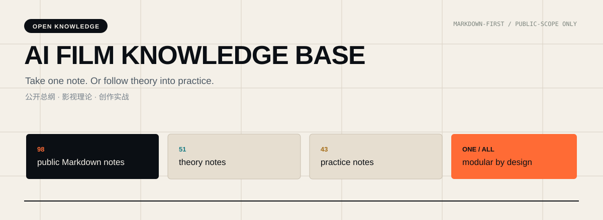
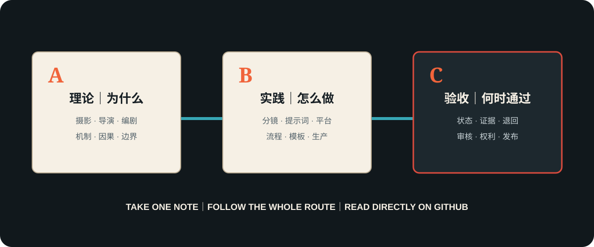

# AI Film Knowledge Base

**Read one note directly on GitHub—or follow the complete route from film judgment to production and review.**

[简体中文](docs/i18n/zh-CN/README.md) · [日本語](docs/i18n/ja/README.md) · [한국어](docs/i18n/ko/README.md) · **English**

## Read directly on GitHub

No installation, database import, Obsidian vault, or companion Skill is required. Open any Markdown note in the repository and read it in GitHub's normal file view. Each note is written to be useful by itself; the indexes connect the same notes into a larger system.

| A · Theory | B · Practice | C · Review |
|---|---|---|
| Understand why a film-language, directing, cinematography, or screenwriting choice works. | Turn judgment into storyboards, prompts, shot output, action direction, and bounded platform workflows. | Freeze the input, review the result, return it to the broken decision, and distinguish technical success from actual acceptance. |
| **51 notes** · [Browse A on GitHub](knowledge/A-理论层/) | **43 notes** · [Browse B on GitHub](knowledge/B-实战层/) | **7 notes** · [Browse C on GitHub](knowledge/C-审核与验收层/) |

You can also open the [complete catalog](CATALOG.md), start from the [public overview](knowledge/00-总纲/), or search the repository for one concrete question.

## What is public

This edition contains **105 authored Markdown notes**:

- 4 public overview and governance notes;
- 51 theory notes in A;
- 43 practice notes in B;
- 7 newly authored public review and acceptance notes in C.

Public C is a reusable review framework, not a copy of the private AI-infrastructure layer or the private retrospective/validation archive. It explains status, evidence, scope control, directed return, five-gate AI-film review, independent Skill use, and public knowledge/image checks without exposing personal projects or private logs.

The `knowledge/` directory remains Markdown-only. Ten explanatory SVGs were created specifically for this public reading edition and live outside the knowledge corpus under `docs/assets/knowledge/`. Their purpose, embed location, authorship basis, and review status are listed in the [visual asset register](docs/VISUAL_ASSETS.md).

## Image publication boundary

The private source vault contained **730 local images**. This release uploads **0 of those source-vault images**:

- **622 conditional candidates** remain private while one explicit, unified redistribution authorization is still missing;
- **86 files** lack sufficient source or rights evidence;
- **22 files** are excluded from public use.

“Conditional candidate” does not mean approved. None of the 730 may enter the public repository unless the missing authorization and per-image publication record are completed. The ten public SVGs are new, original teaching diagrams; they are not traced, copied, or transformed from the withheld source-vault images.

## Built for people and Agents

The canonical knowledge notes are in Simplified Chinese; repository entry pages are available in English, Simplified Chinese, Japanese, and Korean.

Because the corpus is ordinary Markdown, it can be read by people, editors, static-site tools, Codex, Claude Code, TRAE, CodeBuddy, WorkBuddy, and other file-reading Agents. This is a portability claim, not a claim that every product has the same native importer. Give an Agent the exact note or folder that matches the task; it does not need the entire repository.

For executable Agent workflows, see the companion [Open Film Skills](https://github.com/62656456/ai-film-skills). The two repositories are independent: one knowledge note can be read alone, and one Skill can be used alone.

## Review, evidence, and return

The public review route keeps four facts separate: a file exists, its content passes review, a real output works, and a designated reviewer accepts it. When a result fails, the return record identifies the failed gate, observed evidence, earliest broken decision, protected passing items, and proof required for resubmission. Start with [C · Review](knowledge/C-审核与验收层/) for the complete flow.

Time-sensitive model, product, feature, price, specification, or policy claims must be rechecked against a current primary source. Corrections belong in the public errata ledger, never in a hidden personal review layer.

## Repository design

The interface uses a film-research notebook language: script paper, slate black, signal orange, cool cyan, and brass. The information architecture makes the three public routes visible immediately while preserving direct access to every individual note.

The presentation was informed by [OmniRoute](https://github.com/diegosouzapw/OmniRoute): a strong opening thesis, immediate navigation, diagrams, multilingual entry points, visible scope, contribution routes, and explicit security and third-party boundaries. No OmniRoute brand asset, illustration, prose, or code is included.

## Contributing and contact

Read [CONTRIBUTING.md](CONTRIBUTING.md), [docs/CONTENT_POLICY.md](docs/CONTENT_POLICY.md), and [PUBLICATION_SCOPE.md](PUBLICATION_SCOPE.md). Run `python scripts/validate_repository.py` before proposing a change.

- Ideas and discussion: [GitHub Discussions](https://github.com/62656456/ai-film-knowledge-base/discussions)
- Reproducible corrections: [GitHub Issues](https://github.com/62656456/ai-film-knowledge-base/issues)
- Contact: [haldissita@gmail.com](mailto:haldissita@gmail.com)

## License

Personally authored knowledge text and the ten registered original diagrams are licensed under [Creative Commons Attribution 4.0 International](LICENSE), unless a file states otherwise. The license does not grant rights over linked, cited, or otherwise external material.
