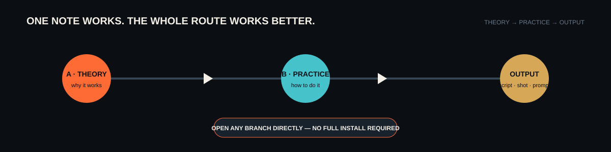

# AI Film Knowledge Base

**Film theory you can understand. Production methods you can take one note at a time.**

[简体中文](docs/i18n/zh-CN/README.md) · [日本語](docs/i18n/ja/README.md) · [한국어](docs/i18n/ko/README.md) · **English**

## Take one note—or follow the whole route

| I need a principle | I need a working method |
|---|---|
| Open **A · Theory** for cinematography, directing, screenwriting, visual grammar, structure, character, dialogue, sound, and editing judgment. | Open **B · Practice** for storyboards, prompt engineering, shot output, action direction, and platform-oriented production methods. |
| [Browse theory](knowledge/A-理论层/) | [Browse practice](knowledge/B-实战层/) |

Every note is a normal Markdown file. You can read one page by itself, download one folder, point an Agent at a specific note, or follow the indexes as one complete film-knowledge system. The knowledge base does not require the companion Skill repository to be useful.

## Start here

| Need | Open |
|---|---|
| Public scope, navigation, content rules, and errata | [`knowledge/00-总纲/`](knowledge/00-总纲/) |
| Cinematography, directing, screenwriting, and film-language theory | [`knowledge/A-理论层/`](knowledge/A-理论层/) |
| Storyboard, prompt, shot, action, and platform practice | [`knowledge/B-实战层/`](knowledge/B-实战层/) |
| Every published note | [`CATALOG.md`](CATALOG.md) |

## What is public

This edition contains **98 authored Markdown notes**:

- 4 public overview and governance notes;
- 51 theory notes;
- 43 practice notes.

It intentionally excludes personal information, personal projects, private retrospectives, private validation records, AI infrastructure notes, inspiration archives, raw chats, company material, credentials, and copied third-party courses.

The source vault contained 730 local image files whose ownership or redistribution rights were not cleared for public release. They are not shipped. The 730 original embeds within the retained theory notes are replaced by explicit rights-review notices, so the public repository has no silent broken local-image links.

## Built for people and Agents

The source language of the knowledge notes is Simplified Chinese. Repository navigation is available in English, Simplified Chinese, Japanese, and Korean.

Because the corpus is Markdown-first, it can be used with Codex, Claude Code, TRAE, CodeBuddy, WorkBuddy, other Agent tools, ordinary editors, or static-site generators. This is content portability, not a claim that every product has an identical knowledge-base importer. Use the exact folder or note your tool can read.

For reusable Agent workflows, see the companion [Open Film Skills](https://github.com/62656456/ai-film-skills) repository. Each Skill works independently; the knowledge base remains a separate public library.

## Evidence and updates

Notes distinguish durable creative mechanisms from time-sensitive platform facts. When a statement depends on a current model, product, price, feature, or policy, verify it against a current primary source before using it as a present-day fact. Corrections belong in the public errata ledger, not in a hidden personal review layer.

## Repository design

The interface uses a film-research notebook language: script paper, slate black, signal orange, cool cyan, and brass. Its central route is intentionally simple—**theory → practice → usable output**—while every branch remains directly accessible.

The information architecture was informed by [OmniRoute](https://github.com/diegosouzapw/OmniRoute): a strong opening thesis, immediate navigation, diagrams, multilingual entry points, visible scope, contribution routes, and explicit security and third-party boundaries. No OmniRoute brand asset, illustration, copy, or code is included.

## Contributing and contact

Read [CONTRIBUTING.md](CONTRIBUTING.md), [docs/CONTENT_POLICY.md](docs/CONTENT_POLICY.md), and [PUBLICATION_SCOPE.md](PUBLICATION_SCOPE.md). Run `python scripts/validate_repository.py` before proposing a change.

- Ideas and discussion: [GitHub Discussions](https://github.com/62656456/ai-film-knowledge-base/discussions)
- Reproducible corrections: [GitHub Issues](https://github.com/62656456/ai-film-knowledge-base/issues)
- Contact: [haldissita@gmail.com](mailto:haldissita@gmail.com)

## License

Personally authored knowledge content is licensed under [Creative Commons Attribution 4.0 International](LICENSE), unless a file states otherwise. The license does not grant rights over linked or cited third-party material.
