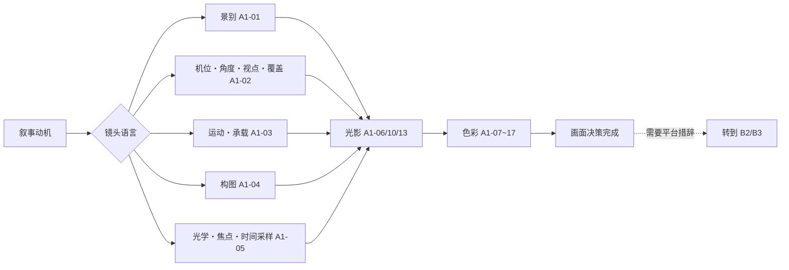

# A1·摄影组·索引

> 用途（分类索引）：A1-摄影组的内部导航。本组是镜头语言与色彩光影的理论层（不绑定 AI 工具）——由旧 09（速查）/11（深度）/12（工程）三区纵向合并而来：镜头语言五卡为「速查层+深度层」双层主题卡，色彩光影十二卡统一落原 12 区工程口径。查"为什么这么拍、拍出来什么效果、参数怎么定"来本组；写成提示词去 B2/B3。

> [!workbench] 摄影台｜从空间关系到画面参数
> **工作顺序**　景别 → 机位/视点/覆盖 → 运动/承载 → 构图 → 光学/焦点/时间采样 → 光影 → 色彩。先说明叙事动机，再选择参数；作者名只作案例来源，不作镜头指令；写成平台提示词时转到 B2/B3。

## 使用路径指引

**镜头语言（选镜头）**
- 定主体尺寸 → [[A1-01 景别系统]]；定机位/角度/视点/覆盖职责 → [[A1-02 镜头角度系统]]
- 定路径、人机关系、速度与承载 → [[A1-03 摄影机运动系统]]
- 定画框余量与空间组织 → [[A1-04 构图系统]]；定视角、透视、景深、特殊光学、帧率/快门/步印 → [[A1-05 焦段与视觉心理]]
- 把原子参数组合成场景级摄影机行为 → A2-导演组 [[A2-08 镜头语言机制与摄影机行为]]

**光影**
- 光影怎么表达情绪（速查+深度） → [[A1-06 光影表达系统]]
- 布光工程参数（光比/色温/主辅轮廓） → [[A1-10 光影构造]]
- 某位 DP 怎么用光 → [[A1-13 摄影指导光影方法]]

**色彩**
- 色彩与影调总览（速查+深度） → [[A1-07 色彩与影调]]
- 色彩为什么起作用（情绪/叙事/世界观机制） → [[A1-08 色彩的情绪·叙事·世界观]]
- 色彩方案怎么构造（15种逻辑·48字段工程卡） → [[A1-09 色彩逻辑构造]]
- 画面哪个区域放什么色 → [[A1-11 画面区域色彩分配]]
- 按类型片/场景直接取配色 → [[A1-16 类型片×场景色彩系统]]
- 导演/DP/美术的色彩档案（同片三卡拼图） → [[A1-12 导演色彩风格]] / [[A1-13 摄影指导光影方法]] / [[A1-14 美术指导色彩系统]]
- 后期调色工艺（DI/ENR/漂白法/ACES/LUT，**全库工艺校正源**） → [[A1-15 后期调色逻辑]]
- 对照经典影片验证方案 → [[A1-17 经典电影色彩案例]]

## 卡片列表（17 张）

| 新ID | 标题 | 前身 | 备注 |
|---|---|---|---|
| A1-01 | [[A1-01 景别系统]] | 09-01 + 11-01部分 | 八级字段统一；功能镜头与景别分层 |
| A1-02 | [[A1-02 镜头角度系统]] | 09-02 + 11-01部分 | 机位几何/视点/覆盖分层；心理映射=倾向 |
| A1-03 | [[A1-03 摄影机运动系统]] | 09-03 + 11-01部分 | 运动六轴/路径/人机关系/承载分层；自命名项降为组合案例 |
| A1-04 | [[A1-04 构图系统]] | 09-05 + 11-04 | 补画框余量；派生场景图式降为组合配方 |
| A1-05 | [[A1-05 焦段与视觉心理]] | 09-06 + 11-01部分 | 格式+视角+机位；补特殊光学、焦点与时间采样 |
| A1-06 | [[A1-06 光影表达系统]] | 09-07 + 11-03 | 工程参数见 A1-10 |
| A1-07 | [[A1-07 色彩与影调]] | 09-08 + 11-02 | |
| A1-08 | [[A1-08 色彩的情绪·叙事·世界观]] | 12-01+02+03 三合一 | 生理断言已降级"倾向" |
| A1-09 | [[A1-09 色彩逻辑构造]] | 12-04 | 漂白法史实已订正 |
| A1-10 | [[A1-10 光影构造]] | 12-05 | 光比=约/倾向 |
| A1-11 | [[A1-11 画面区域色彩分配]] | 12-06 | |
| A1-12 | [[A1-12 导演色彩风格]] | 12-07 | 《幻之光》DP=中堀正夫 |
| A1-13 | [[A1-13 摄影指导光影方法]] | 12-08 | 含共享译名名录 |
| A1-14 | [[A1-14 美术指导色彩系统]] | 12-09 | |
| A1-15 | [[A1-15 后期调色逻辑]] | 12-10 | **工艺校正源**（漂白法/ENR 口径以此为准） |
| A1-16 | [[A1-16 类型片×场景色彩系统]] | 12-11+12-12 二合一 | hex=建议起点 |
| A1-17 | [[A1-17 经典电影色彩案例]] | 12-13 | 含独有"色彩叙事曲线" |

## 组内口径备忘（承 00-总纲合规准则）
- **物理量精确，心理量倾向**：色温/波长/工艺链可证伪必须准；"红=激情/仰拍=权力"只写倾向+文化相对。
- **hex 均为建议起点色**，非影片实测；光比为约数区间。
- **译名锚**：共享译名名录在 A1-12/13/14 卡尾（中堀正夫/洪京表/约翰·希尔/迪安·康迪/克罗嫩韦斯父子）。
- **工艺口径**：漂白法/ENR 一律以 A1-15 为准。
- 器材型号=提示词风格标签，非史实（免责范例见 B2《电影级图片提示词Skill》）。

## 跨组连接
- 镜头/色彩理论 → 写成提示词：**B2-提示词工程组**（七字段/电影级参数/转化规则）
- 即梦中文措辞 → **B3-平台实战组**《即梦运镜光影术语完整词库》
- 调度/剪辑/声音/类型片/作者案例与镜头机制组合 → **A2-导演组**（A2-08 为场景级摄影机行为入口）；剧本戏剧功能 → **A3-编剧组**
- 分镜落地 → **B1-分镜产出组**
