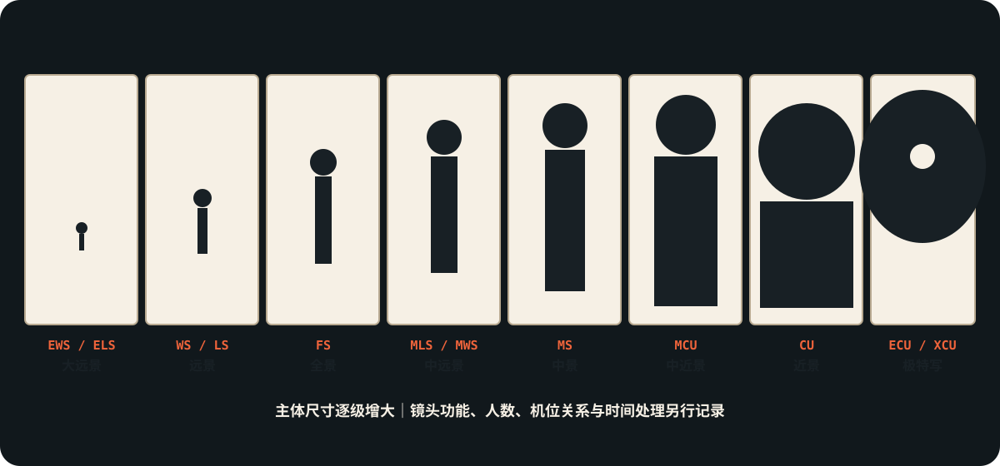

# 景别系统

> **公开图像说明：** 原资料中未完成再分发权核验的图片不进入公开仓库；本页只显示已登记的原创公共图示。详见 [视觉资产登记](../../../docs/VISUAL_ASSETS.md)。
> 用途（速查+深度）：先用八级景别合同确定主体在画幅中的相对尺寸，再按叙事任务选择景别变化。原卡中的建立、反应、插入、空镜等保留为镜头功能案例，但不再冒充景别；覆盖职责统一由 A1-02 管，时间采样统一由 A1-05 管。
> 分工：本卡管"为什么选、选错会怎样"（决策+误区）；写进即梦提示词的中文措辞见 B3-平台实战组《即梦运镜光影术语完整词库》。

## 八级景别合同（统一记录字段）



> [!important] 先统一字段，再谈审美
> 景别边界在不同国家、剧组和教材中会有细微差异。本库以主体在画幅中的尺寸/身体裁切为可观察标准，正式分镜优先记录唯一英文缩写；中文别名只作阅读辅助。

| 统一字段 | 本库中文 | 可观察边界 | 不可混入 |
|---|---|---|---|
| EWS / ELS | 大远景 / 极远景 | 人物只提供尺度，环境主导 | 建立镜头（功能） |
| WS / LS | 远景 | 全身可见，环境仍承担行动信息 | 空镜（有无人） |
| FS | 全景 | 人物全身成为主要画面单位 | Master（覆盖职责） |
| MLS / MWS | 中远景 | 约膝部或大腿以上；Cowboy 只作生产别名 | 双人镜头（人数） |
| MS | 中景 | 约腰部以上 | 正反打（序列关系） |
| MCU | 中近景 | 约胸部以上 | 越肩（机位关系） |
| CU | 近景（Close-up） | 面部或关键主体主导画面 | Insert（覆盖职责） |
| ECU / XCU | 极特写 | 眼、嘴、手指等局部占满画面 | 慢动作（时间处理） |

> BCU / Choker 可在具体剧组合同中作为 CU 与 ECU 之间的可选别名；不作为全库必填字段。“特写”在中文语境容易同时指 CU 与细节镜头，正式机器字段一律写 CU / ECU，避免歧义。

### 功能镜头归属校准

- Establishing、Master、Single、Two-shot、Group、OTS、Shot/Reverse、Insert、Cutaway、Reaction：归 A1-02 的覆盖系统。
- Slow motion、Fast motion、Time-lapse、Step printing：归 A1-05 的时间采样系统。
- 本卡下方既有“插入/空镜/建立/反应”内容作为历史案例和跨卡速查保留；使用时按“镜头功能”读取，不计入八级景别。

## 既有综合速查层（识别词典，不作景别计数）

> [!boundary] 本节为什么仍保留 14 项
> 前 10 项保留旧库的细分阅读口径；机器执行仍以本卡开头的八级字段为准。插入、空镜、建立、反应是镜头功能，归 A1-02 覆盖职责；它们留在这里仅为兼容旧链接和既有视觉资产。

| 名称 | 英文 | 核心定义 | 视觉与情绪 | 叙事/空间功能 | 常见案例 | 常见错误 |
|---|---|---|---|---|---|---|
| 大远景/极远景 | Extreme wide shot / Extreme long shot | 人物极小，环境占主导 | 孤独、渺小、史诗尺度、命运感 | 建立世界尺度，显示人物被空间吞没 | 《阿拉伯的劳伦斯》《沙丘》《疯狂的麦克斯：狂暴之路》 | 只拍大场面而没有人物目标，容易变成风景明信片 |
| 远景 | Long shot / Wide shot | 人物全身可见，环境仍重要 | 保持距离，观察行动 | 交代人物与地形、敌我、障碍的关系 | 《火星救援》《七武士》 | 远景太久会削弱表演细节 |
| 全景 | Full shot | 人物全身占据主要画面 | 动作清楚，身体语言完整 | 展示走位、打斗、舞蹈、群体关系 | 《低俗小说》《卧虎藏龙》 | 切太碎会破坏动作连续性 |
| 中远景 | Medium long shot | 膝盖或大腿以上 | 兼顾姿态和表情 | 对话、对峙、拔枪、站位权力关系 | 《黄金三镖客》《国王的演讲》 | 当作普通中景使用会丢失身体动势 |
| 中景 | Medium shot | 腰部以上 | 最中性的交流距离 | 对话覆盖、人物互动、信息交代 | 《社交网络》《教父》 | 过度依赖会让影像变电视化 |
| 中近景 | Medium close-up (MCU) | 胸部以上 | 亲近但仍保留一点距离 | 观察表情变化，保留少量环境 | 《老无所依》《婚姻故事》 | 背景信息不足时会削弱空间感 |
| 近景 | Close-up / Close shot | 面部或重要物体占主导 | 强化情绪、反应、决定时刻 | 让观众进入人物内心 | 《沉默的羔羊》《花样年华》 | 情绪没有积累就滥用近景，会显得廉价 |
| 特写 | Close-up / Detail shot | 关键局部被突出 | 注意力集中，心理压力增大 | 指向线索、伤口、信物、武器 | 《惊魂记》《十二宫》 | 把所有道具都特写会稀释重点 |
| 大特写 | Big close-up | 面部更紧，额头或下巴可被切掉 | 强烈亲密、压迫、审问感 | 捕捉微表情和崩溃边缘 | 《女巫布莱尔》《黑天鹅》 | 没有表演支撑时会显得生硬 |
| 极特写 | Extreme close-up | 眼睛、嘴、手指、扳机等极小局部 | 紧张、偏执、身体化 | 把心理变化转化为物理细节 | 《黑天鹅》《梦之安魂曲》 | 误把极特写当作"高级感"装饰 |
| 插入镜头 | Insert shot | 插入物件或动作细节 | 让信息落点明确 | 显示证据、计时器、按钮、照片 | 《盗梦空间》陀螺，《007》装备 | 插入太多会打断戏剧流 |
| 空镜 | Empty shot / Cutaway | 无主要人物的空间或物件镜头 | 暂停、余韵、等待、荒凉 | 建立氛围，转场，暗示人物缺席 | 小津安二郎"枕头镜头" | 只为"文艺感"插入会显得空泛 |
| 建立镜头 | Establishing shot | 场景开头明确地点和空间 | 让观众知道身在何处 | 建立地理、时间、社会环境 | 《银翼杀手》城市开场，《指环王》远景 | 每场都机械使用会拖慢节奏 |
| 反应镜头 | Reaction shot | 拍人物对事件的反应 | 情绪传递，观众代入 | 先看人如何理解奇观，再看奇观本身 | 斯皮尔伯格《侏罗纪公园》《E.T.》 | 反应与事件不匹配会显得假 |

> 术语校准：中英对照以「近景 = Close-up / Close shot；中近景 = Medium close-up (MCU)」为准。MCU 唯一对应中近景，不用于标注近景。

## 逐项视觉（单张）

> [!visual-note] 使用边界
> 以下均为本任务原创写实视觉示意，用于建立景别的直观印象，不是特定电影截图，也不替代真实机位、画幅与镜头测试。每张图只解释一个知识点，名称和看点已直接标在画面内。

### 选景别决策逻辑

人物处境 → 空间关系 → 情绪距离 → 信息显露顺序 → 镜头尺度

---

## 深度层（为什么有效·案例·AI转化）

节奏衔接类深度条目：慢动作 / 反应镜头 / 空镜 / 大远景。定义与速查表一致处不重复，只保留原理、案例与转化。

可信度评级：✅已验证（多源交叉确认）/ ⚠️部分验证（核心事实确认，部分细节待查）/ ❓待验证（单一来源，仅作线索）。案例一律标注「电影名+年份+导演+DP+具体段落」，不编造。

### 慢动作（Slow Motion）

```text
核心原理：      以高于放映帧率（如 48/96/120fps）拍摄再以 24fps 回放，单位时间被拉长，瞬时动作/情绪被"展开"放大，使观众得以凝视平时无法捕捉的瞬间，赋予其仪式感与情绪重量。
视觉效果：      动作被放缓拉长、细节被放大、画面带有"时间凝固"的质感，常配抒情音乐。
情绪功能：      凝视、留恋、悲怆、浪漫、宿命、瞬间的神圣化。
叙事功能：      放大关键情绪瞬间、标记记忆/创伤点、抒情蒙太奇、延缓高潮以累积张力。
适用场景：      关键情绪瞬间、回忆/创伤闪回、浪漫抒情、暴力/动作的诗化、高潮延宕。
不适用场景：    需要写实节奏的日常戏、推动剧情的对话段（慢放拖沓）、过度使用导致廉价感。
真实案例：      《花样年华》In the Mood for Love, 2000，导演 王家卫，DP Christopher Doyle & 李屏宾——周慕云与苏丽珍在窄巷/走廊擦身而过的慢动作，配梅林茂《Yumeji's Theme》，凝固暧昧与压抑的情绪瞬间。
来源链接：      https://en.wikipedia.org/wiki/In_the_Mood_for_Love ；https://www.studiobinder.com/blog/different-types-of-camera-movements-in-film/
可信度评级：    ✅已验证
AI分镜转化：    景别：中景/近景；帧率：高帧拍摄（48–120fps）慢放回放；运镜：固定或极缓推；时长：实拍 2 秒→回放 4–6 秒。镜注写"慢动作，凝固情绪瞬间，配抒情音乐"。
AI图片提示词转化：  slow motion aesthetic, suspended frozen-in-time moment, dreamy elongated instant, cinematic slow-motion still, soft lyrical mood
AI视频提示词转化：  slow motion, high frame rate 96fps played back slow, time-stretched emotional instant, dreamy lyrical suspension, graceful slowed movement
可检索关键词：    slow motion, slow mo, 慢动作, 高帧率, 情绪凝固, overcrank
关联知识点：    甩镜（见本组 A1-03）、推镜（见本组 A1-03）、空镜、反应镜头
常见错误：      为慢而慢——无情绪动机的慢放拖沓；忘记慢放需配相应音乐/声效才成立。
待确认问题：    《花样年华》巷口慢动作段的具体拍摄帧率待 DP 访谈确认。
```

### 反应镜头（Reaction Shot）

```text
核心原理：      观众对奇观的震撼程度，部分来自"看到别人如何震惊"——角色反应成为情绪锚点与代入通道；先给反应再给（或同给）奇观，能放大奇观分量并让观众与角色共情，这是斯皮尔伯格的标志性方法。
视觉效果：      画面在"奇观"与"角色仰望/震惊的脸"之间建立因果，角色的瞳孔/微表情成为奇观的"度量衡"。
情绪功能：      代入、惊奇、敬畏、共情、期待。
叙事功能：      用角色反应为奇观定调、放大事件冲击、建立观众与角色的情感同盟。
适用场景：      奇观首次呈现、重大事件冲击、需要观众共情代入的瞬间、儿童视角的发现。
不适用场景：    反应本身无信息时（无谓切镜）、节奏需直给动作时、反应演员表演空洞时。
真实案例：      ①《侏罗纪公园》Jurassic Park, 1993，导演 Steven Spielberg，DP Dean Cundey——众人首次目睹腕龙时，先/同给角色仰望震惊的反应镜头，再呈现恐龙奇观，让观众通过角色代入。②《E.T. 外星人》E.T., 1982，导演 Steven Spielberg，DP Allen Daviau——孩子面对 E.T. 的反应镜头作为情感代入通道。
来源链接：      https://en.wikipedia.org/wiki/Jurassic_Park_(film) ；https://en.wikipedia.org/wiki/E.T._the_Extra-Terrestrial
可信度评级：    ✅已验证
AI分镜转化：    景别：近景反应 + 全景奇观交替；运镜：反应镜可缓推；时长：反应 2–3 秒 + 奇观 3–4 秒。镜注写"反应镜头先行/同步，用角色表情为奇观定调"。
AI图片提示词转化：  reaction shot, character's awestruck face lit by off-screen wonder, wide eyes looking up, awe and disbelief, emotional anchor framing
AI视频提示词转化：  reaction shot, slow push-in on character's stunned upturned face, then reveal the spectacle, awe and wonder through their expression
可检索关键词：    reaction shot, Spielberg method, 反应镜头, 奇观代入, awe reaction
关联知识点：    移焦（见本组 A1-05）、推镜（见本组 A1-03）、慢动作、空镜
常见错误：      只拍奇观不拍反应——奇观失去情绪度量；反应演员表演过火或空洞则反噬代入。
待确认问题：    "斯皮尔伯格方法"作为命名术语的学术出处待确认（手法本身多源证实，命名待考）。
```

### 空镜（Empty Shot / Pillow Shot）

```text
核心原理：      在叙事段落间插入无人/无主信息的画面，打断情节推进、给情绪沉淀的空间，类似俳句中的"枕词"，让观众从角色抽离、回味上一段的余韵，为下一段蓄势。
视觉效果：      空走廊、晾晒的衣物、静物、风景等无人画面，构图安静、信息低密度。
情绪功能：      留白、余韵、禅意、孤独、时间的流逝、情绪沉淀。
叙事功能：      段落间过渡与缓冲、调节节奏、外化角色心境（以景写情）、标记时间流逝。
适用场景：      段落过渡、情绪需要沉淀处、东方留白美学、表现时间流逝/日常的静谧。
不适用场景：    节奏需紧凑推进时、信息密度要求高的悬疑推进、无目的的"凑镜"。
真实案例：      小津安二郎"枕镜头"（pillow shots）——《东京物语》Tokyo Story, 1953，导演 小津安二郎，DP 厚田雄春——场景间插入空走廊、晾衣、风景等空镜，作为情绪缓冲与留白，是小津标志性的节奏手法。
来源链接：      https://en.wikipedia.org/wiki/Tokyo_Story ；https://en.wikipedia.org/wiki/Yasujir%C5%8D_Ozu
可信度评级：    ✅已验证
AI分镜转化：    景别：全景/中景空景；运镜：固定；时长：2–4 秒。镜注写"空镜（枕镜头），段落间留白缓冲，情绪沉淀"。
AI图片提示词转化：  empty shot / pillow shot, quiet unoccupied space, still landscape or corridor, low information calm composition, contemplative negative space
AI视频提示词转化：  static empty shot, quiet unoccupied scene held for a beat, still life or empty corridor, contemplative pause between scenes
可检索关键词：    empty shot, pillow shot, 空镜, 枕镜头, 留白, 小津安二郎
关联知识点：    慢动作、拉镜（见本组 A1-03）、负空间（见本组 A1-04）、反应镜头
常见错误：      把空镜当"转场填充"乱插——无情绪逻辑的空镜只是拖节奏；插入位置/时长不当破坏节奏。
待确认问题：    "枕镜头"（pillow shot）术语的最初学术提出者（常归于 Noël Burch）待确认出处。
```

### 大远景（Extreme Long Shot / Establishing Scale）

```text
核心原理：      人物在画面中占比极小，环境/景观占据绝对主导，构图上以巨大参照物（沙漠、巨物、城市）衬托人物，心理上触发"个体 vs 浩瀚"的渺小与敬畏。
视觉效果：      人物如点缀置于辽阔景观/巨型结构中，环境成为画面主体，比例悬殊。
情绪功能：      渺小、敬畏、孤独、史诗感、宿命、未知。
叙事功能：      建立世界尺度与地理关系、标记史诗段落、反衬人物在命运/自然面前的渺小。
适用场景：      开场建立世界观、史诗/末日/科幻景观、表现人物渺小与孤独、转场地理交代。
不适用场景：    需要角色情绪细节时、室内对话戏、节奏需紧凑的近景段落。
真实案例：      ①《疯狂的麦克斯：狂暴之路》Mad Max: Fury Road, 2015，导演 George Miller，DP John Seale——沙漠大远景建立末日世界的辽阔尺度。②《沙丘》Dune, 2021，导演 Denis Villeneuve，DP Greig Fraser——沙漠与巨型沙虫远景令人物渺小，建立史诗尺度。
来源链接：      https://www.studiobinder.com/blog/types-of-camera-shots-sizes-in-film/ ；https://en.wikipedia.org/wiki/Mad_Max:_Fury_Road
可信度评级：    ✅已验证
AI分镜转化：    景别：大远景（人物占画面 1/10 以下）；焦段：广角；机位：高远或超远距离；运镜：固定或极缓横移；时长：4–6 秒。镜注写"大远景，建立世界尺度，反衬人物渺小"。
AI图片提示词转化：  extreme long shot, tiny human figure dwarfed by vast landscape, epic monumental scale, immense environment dominating frame
AI视频提示词转化：  extreme wide shot, vast epic landscape, tiny figure moving through immense environment, slow majestic drift, sense of awe and insignificance
可检索关键词：    extreme long shot, establishing shot, 大远景, 史诗尺度, 人物渺小, epic scale
关联知识点：    高角度俯拍（见本组 A1-02）、拉镜（见本组 A1-03）、负空间/人物比例与空间关系（见本组 A1-04）
常见错误：      人物过小到看不见（失去叙事锚点）；只用大远景不切近景导致情感疏离。
待确认问题：    《沙丘》远景段所用的具体广角焦距与 IMAX 画幅比例待技术资料细化。
```
