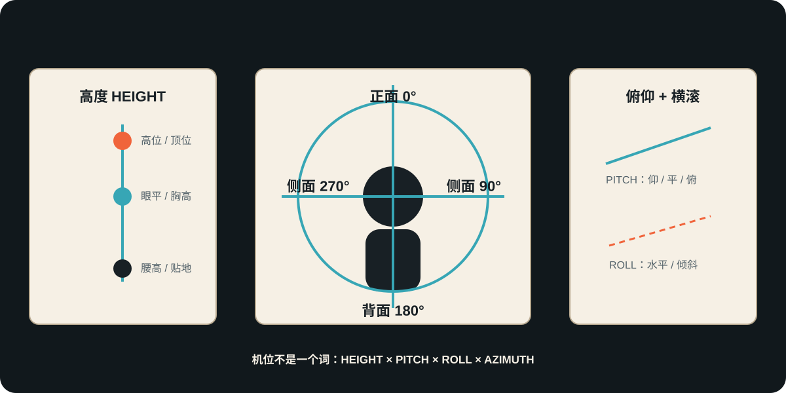

# 镜头角度系统（机位·视点·覆盖）

> **公开图像说明：** 原资料中未完成再分发权核验的图片不进入公开仓库；本页只显示已登记的原创公共图示。详见 [视觉资产登记](../../../docs/VISUAL_ASSETS.md)。
> 用途（速查+深度）：把“摄影机放在哪里、由谁在看、这一镜在剪辑中负责什么”拆成机位几何、视点归属和覆盖职责三层，再选择具体角度。原18项视觉示例保留，但不再把高低角、POV、监控界面和门框构图当成同一种参数。
> 分工：本卡管"为什么选、选错会怎样"（决策+误区）；写进即梦提示词的中文措辞见 B3-平台实战组《即梦运镜光影术语完整词库》。
> 心理映射校准：本卡"仰拍=权力、俯拍=脆弱"一类角度-心理映射是**倾向而非定律**——源自好莱坞古典传统惯例，具有文化相对性，实际效果取决于上下文（同一俯拍可表脆弱也可表奇观展示）。使用时以本场戏的叙事动机为准，不机械套用。

## 分类合同：机位不是一个词，而是四个坐标

| 坐标 | 回答的问题 | 标准记录 | 常见混淆 |
|---|---|---|---|
| 高度 Height | 镜头中心相对主体多高？ | 贴地 / 腰高 / 胸高 / 眼平 / 高位 / 顶位 | 低机位不一定仰拍 |
| 俯仰 Pitch | 光轴向上、水平还是向下？ | 仰拍 / 平视 / 俯拍 / 正顶视 | 鸟瞰是高度+俯拍的组合 |
| 横滚 Roll | 地平线是否水平？ | 水平 / Dutch angle / 动态 roll | 静态倾斜不等于摄影机旋转 |
| 方位 Azimuth | 摄影机在主体哪一侧？ | 正面 / 前3/4 / 侧面 / 后3/4 / 背面 | “背影”不是独立构图定律 |

### 机位方位罗盘



- **正面 Frontal**：表情最完整，也最容易形成被凝视或宣告感。
- **前3/4 Three-quarter front**：同时保留表情与身体朝向，是最通用的人物观察位。
- **侧面 Profile**：强化人与目标、两人对峙或方向关系，削弱正面亲密。
- **后3/4 Three-quarter rear**：保留少量侧脸，把观众放到人物身后共同面对空间。
- **背面 Rear**：隐藏表情、强调进入未知或退出关系；需要用动作、环境或声音补足信息。

### 高度与俯仰矩阵

> Worm's-eye 应记录为“贴地高度＋向上俯仰”；Bird's-eye / Overhead 应记录为“高位或顶位＋向下俯仰”。把组合拆开，才能在另一个场景复用。

## 视点归属：是谁在看

| 视点 | 可观察定义 | 适用任务 | 失败方式 |
|---|---|---|---|
| 客观 Objective | 摄影机不冒充场内任何人的眼睛 | 让观众自行判断关系 | “客观”被误解为无构图 |
| 角色对齐 Character-aligned | 靠近人物位置与信息范围，但仍看得到人物 | 跟随其行动和认知 | 与POV归属混乱 |
| 半主观 Semi-subjective | 肩、后脑或身体边缘提示视点归属 | 既代入又保留外部观察 | 遮挡没有空间意义 |
| 主观 POV | 画面近似人物当下所见 | 危险、窥视、错觉、选择 | 没有前后反应镜头建立归属 |
| 系统观看 System view | 监控、卫星、战术界面等非人物设备视点 | 制度观看、证据、不完整视野 | 普通画面只叠一个界面框 |

> 新闻纪实、监控、卫星、战术地图是“观看媒介/主体”的修饰词，不是俯仰角；镜中视角、门框/窗框视角是反射与框中框构图，基础机制归 A1-04。本卡既有示例保留作跨类词汇，不再计入角度一级分类。

## 覆盖职责：这一镜为什么要拍

| 覆盖名称 | 英文 | 镜头职责 | 最常见误用 |
|---|---|---|---|
| 建立镜头 | Establishing shot | 交代地点、时间或关键地理关系 | 与主镜头混为一谈 |
| 主镜头 | Master shot | 覆盖一整段动作/表演，给剪辑提供空间基准 | 必须是远景；其实可为移动镜头 |
| 单人镜头 | Single | 画面主要承担一个人的动作/反应 | 当作景别；它可远可近 |
| 双人/群体镜头 | Two-shot / Group shot | 同框读关系、距离和权力 | 人数到齐但关系不可读 |
| 越肩 | OTS | 用前景肩/头建立对话归属与轴线 | 肩部遮挡过多或机位越轴 |
| 净单人 | Clean single | 画面无对手身体边缘，强调主体独立 | 与情境完全断开 |
| 脏单人 | Dirty single | 保留对手肩/头/前景边缘，维持关系压力 | 前景只是黑块，没有对话方向 |
| 正反打 | Shot / reverse shot | 成对镜头维持视线、轴线与信息交换 | 两边焦距/高度无动机漂移 |
| 插入镜头 | Insert | 把关键动作或物件落到可读细节 | 与ECU景别混同 |
| 切出镜头 | Cutaway | 暂离主动作，补环境、旁观者或时间信息 | 只为遮剪辑点而无叙事价值 |
| 反应镜头 | Reaction shot | 让事件意义落到人物如何理解它 | 反应与事件先后、视线不匹配 |

> 180度轴线、视线匹配和动作匹配的唯一完整规则在 A2-01；本卡只说明覆盖镜头怎样落在该连续性系统中。

## 既有综合速查层（识别词典，不作单轴分类）

> [!boundary] 本节为什么仍保留 18 项
> 平/俯/仰/倾斜主要描述机位姿态；POV、半主观、客观、监控、新闻描述视点归属或媒介视角；越肩、镜中、门窗框还包含人物关系与构图。旧词条与图片保留供识别，正式镜头单必须分别填写“方位 + 高度 + 俯仰 + 滚转 + 视点 + 覆盖职责”。

| 名称 | 英文 | 心理效果 | 权力/危险/亲密 | 适合题材与案例 | 常见错误 |
|---|---|---|---|---|---|
| 平视镜头 | Eye-level shot | 中性、平等、观察 | 人物与观众处于同一心理高度 | 现实主义、对话戏，《东京物语》 | 中性不等于无设计 |
| 仰拍 | Low angle | 强化体量、威胁或英雄感（倾向） | 被摄者更有权力（倾向） | 《公民凯恩》《变形金刚》 | 任何人物都仰拍会削弱含义 |
| 低角度仰拍 | Extreme low angle | 压迫、神化、怪物感 | 观众处于被压制位置 | 黑色电影、超级英雄、怪兽片 | 忽视背景天花和透视畸变 |
| 俯拍 | High angle | 脆弱、被观察、被困（倾向） | 人物权力降低（倾向） | 《惊魂记》浴室俯拍《寄生虫》 | 只为构图好看而失去动机 |
| 高角度俯拍 | Extreme high angle | 命运视角、系统视角 | 人物像棋子 | 战争、灾难、史诗，《敦刻尔克》 | 太远导致观众不知看什么 |
| 鸟瞰 | Bird's-eye view | 抽象、秩序、地图化 | 强化系统和地理 | 犯罪、战争、城市片 | 只做航拍展示会像旅游片 |
| 虫视 | Worm's-eye view | 巨物压顶、仰望未知 | 强烈渺小感 | 科幻、怪兽、建筑空间 | 透视夸张不服务情绪 |
| 荷兰角/倾斜角 | Dutch angle / Canted angle | 不稳定、失衡、心理异常 | 世界秩序倾斜 | 《第三人》《雷神》部分场景 | 滥用会变成廉价惊悚符号 |
| 过肩视角 | Over-the-shoulder | 对话归属、空间连续 | 建立视线和关系 | 对话、审问、谈判 | 肩膀遮挡过多或轴线混乱 |
| 主观视角 POV | Point-of-view | 观众临时进入角色眼睛 | 强化危险、窥视、错觉 | 《后窗》《潜水钟与蝴蝶》 | 长时间 POV 容易疲劳 |
| 半主观视角 | Semi-subjective | 跟随人物但仍保留外部观察 | 既代入又保持判断 | 惊悚、战争、追逐 | 视角归属不清 |
| 客观观察视角 | Objective observer | 冷静、旁观、距离 | 让观众自行判断 | 纪录片、社会写实 | 误以为客观就不需要构图 |
| 监控视角 | Surveillance view（描述性分类·信息界面视角） | 非人性、控制、证据感 | 人被系统观看 | 犯罪、科幻、政治惊悚 | 没有界面逻辑时显得假 |
| 新闻纪实视角 | News / reportage | 现场、混乱、即时性 | 强化现实危机 | 《血色星期天》《菲利普船长》 | 手持晃动过度影响信息 |
| 卫星视角 | Satellite view（描述性分类·信息界面视角） | 宏观控制、军事系统 | 人物成为坐标 | 军事、谍战、灾难 | 当作普通转场会显得游戏化 |
| 战术地图视角 | Tactical map view（描述性分类·信息界面视角） | 行动逻辑、战场态势 | 强化计划与压力 | 战争、抢劫、科幻军事 | 地图信息与实景不对应 |
| 镜中视角 | Mirror view | 分裂、自我观察、欺骗 | 人物面对另一个自己 | 《出租车司机》《黑天鹅》 | 只拍倒影而无心理意义 |
| 门框/窗框视角 | Door/window frame | 被隔离、窥视、等待 | 空间把人物分割 | 黑色电影、家庭剧、惊悚 | 框中框太刻意会喧宾夺主 |

> 分类校准：监控/卫星/战术地图三项是**描述性分类·信息界面视角**（依赖界面/媒介逻辑呈现），非传统摄影机机位角度术语，与其余条目不在同一分类学层级。

### 逐项画面速认

> [!visual-note] 使用边界
> 下列图片为本知识库制作的**原创视觉示意，非光学/心理实证**。图中“看点”只帮助识别机位或视角归属；心理效果仍须结合上表的倾向性校准与具体叙事上下文判断。

### 角度选择三问

1. 这场戏谁有权力？角度要回答。
2. 观众和人物的心理距离是多少？
3. 环境对人物是保护还是压迫？

---

## 深度层（为什么有效·案例·AI转化）

机位类深度条目：低机位仰拍 / 高角度俯拍 / 荷兰角。定义与速查表一致处不重复，只保留原理、案例与转化。

可信度评级：✅已验证（多源交叉确认）/ ⚠️部分验证（核心事实确认，部分细节待查）/ ❓待验证（单一来源，仅作线索）。案例一律标注「电影名+年份+导演+DP+具体段落」，不编造。

### 低机位仰拍（Low Angle Shot）

```text
核心原理：      透视变形使被摄体下大上小、背景被压低，心理上触发"仰望→权威/威慑"的认知映射。
校准注：        "仰望→权威"是倾向性映射，源自好莱坞古典传统惯例，具文化相对性，非普适定律；效果依赖上下文与表演支撑。
视觉效果：      人物显得高大、身腿比例拉长，天花板/天空被压入画面，产生上升感与体量感。
情绪功能：      英雄感、权威感、压迫感、威胁感、崇高感。
叙事功能：      确立人物权力地位、放大反派威胁、标记角色"崛起/掌权"时刻。
适用场景：      英雄登场/觉醒、反派压制、权力转移节点、巨型建筑/雕像呈现。
不适用场景：    日常对话戏（会莫名神化角色）、需表现人物脆弱/失败时、追求自然纪实感时。
真实案例：      ①《黑客帝国》The Matrix, 1999，导演 Lana & Lilly Wachowski，DP Bill Pope——Neo 挺身对抗特工、楼顶觉醒段落的仰拍，配合子弹时间放大"救世主"体量。②《公民凯恩》Citizen Kane, 1941，导演 Orson Welles，DP Gregg Toland——凯恩演讲/被废黜时的低角度仰拍（甚至纳入天花板），用仰角外化其权力膨胀与崩塌。
来源链接：      https://www.studiobinder.com/blog/types-of-camera-shot-angles-in-film/ ；https://en.wikipedia.org/wiki/Citizen_Kane
可信度评级：    ✅已验证
AI分镜转化：    景别：中近景；机位：低机位（镜头约膝高以下，向上 15–30° 仰角）；运镜：固定或缓推；时长：3–4 秒。镜注写"低角度仰拍，强化人物权力感"。
AI图片提示词转化：  low angle shot, shot from below knee level looking up, subject looming large and powerful, imposing heroic upward perspective, dramatic low camera angle
AI视频提示词转化：  low angle, camera tilted up at the character from ground level, slow subtle push-in, heroic imposing presence, cinematic
可检索关键词：    low angle, low angle shot, 仰拍, 低机位, 英雄感, 压迫感, power shot
关联知识点：    高角度俯拍、荷兰角、推镜（见本组 A1-03）、中心构图/人物比例与空间关系（见本组 A1-04）
常见错误：      仰角过大导致下巴/鼻孔夸张变形（除非刻意丑化）；仰拍日常对话让普通角色莫名"伟岸"。
待确认问题：    《黑客帝国》具体仰拍段落（楼顶 vs 走廊）的精确时间码待复核。
```

### 高角度俯拍（High Angle Shot）

```text
核心原理：      视点高于主体等于"俯视→支配/审视"，主体在画面中被环境压缩，心理上触发"被压制、无力"的映射。
校准注：        "俯视→脆弱"是倾向性映射，源自好莱坞古典传统惯例，具文化相对性，非普适定律；俯拍亦常用于奇观展示、地理交代等中性用途。
视觉效果：      人物被环境包裹、头顶可见、体量缩小，常配合大景别呈现其在空间中的微不足道。
情绪功能：      脆弱、无助、孤独、被审视、宿命感。
叙事功能：      标记角色陷入困境/失败/被围困，建立环境对人的压迫关系。
适用场景：      角色陷入绝境、被围困、孤立无援、失败/坠落前后的情绪低点。
不适用场景：    需要强化角色主体性/英雄感时、紧凑动作戏（俯拍削弱冲击力）、日常正反打。
真实案例：      《复仇者联盟》The Avengers, 2012，导演 Joss Whedon，DP Seamus McGarvey——高空俯拍复仇者群像/纽约战场，使人物相对城市环境显得渺小、脆弱，对比奇观尺度。
来源链接：      https://www.studiobinder.com/blog/types-of-camera-shot-angles-in-film/ ；https://en.wikipedia.org/wiki/The_Avengers_(2012_film)
可信度评级：    ⚠️部分验证
AI分镜转化：    景别：全景/大远景；机位：高机位（镜头高于人物头顶 3–10 米，向下 30–60° 俯角）；运镜：固定或缓降；时长：3–5 秒。镜注写"高角度俯拍，表现人物渺小/脆弱"。
AI图片提示词转化：  high angle shot, top-down perspective looking down on subject, character small and vulnerable within vast environment, bird's-eye downward view
AI视频提示词转化：  high angle, camera looking down from above, slow descending drift, character appearing small and isolated, cinematic
可检索关键词：    high angle, high angle shot, 俯拍, 高机位, 脆弱, 渺小, vulnerability
关联知识点：    低机位仰拍、大远景（见本组 A1-01）、负空间/人物比例与空间关系（见本组 A1-04）
常见错误：      俯角过大变纯顶视（overhead）丢失人物表情与方向；滥用俯拍让所有角色都显得弱。
待确认问题：    《复仇者联盟》中"俯拍=脆弱"对应的具体段落需精确复核（该片俯拍亦用于奇观展示，并非一律表脆弱）。
```

### 荷兰角（Dutch Angle / Canted Angle）

```text
核心原理：      打破观众对"水平=稳定"的本能预期，制造视觉失衡，进而外化角色心理失衡或世界的异常。
视觉效果：      画面倾斜、建筑/地平线歪斜，构图"不对劲"，常伴随不安的几何。
情绪功能：      不安、失衡、疯狂、错乱、危机、异化。
叙事功能：      指示角色精神状态异常、环境不可信、局势失控、即将到来的危险。
适用场景：      惊悚/黑色/心理题材、角色崩溃或受欺骗的段落、反派主导的扭曲空间。
不适用场景：    正常叙事对话（会持续制造无谓不安）、纪实风格、需传达秩序/稳定的场合。
真实案例：      ①《第三人》The Third Man, 1949，导演 Carol Reed，DP Robert Krasker——战后维也纳大量荷兰角，外化世界的倾斜与人物心理失衡，是荷兰角的教科书级应用。②《碟中谍》Mission: Impossible, 1996，导演 Brian De Palma，DP Stephen H. Burum——悬疑/紧张段落使用倾斜构图强化不安。
来源链接：      https://www.studiobinder.com/blog/types-of-camera-shot-angles-in-film/ ；https://en.wikipedia.org/wiki/The_Third_Man
可信度评级：    ✅已验证
AI分镜转化：    景别：中景；机位：荷兰角（画面水平线倾斜 15–25°）；运镜：固定；时长：2–3 秒。镜注写"荷兰角，外化心理失衡/不安"。
AI图片提示词转化：  dutch angle, canted tilted framing, diagonal horizon, off-kilter composition, unsettling disorienting perspective
AI视频提示词转化：  dutch angle, tilted camera frame, slightly canted horizon, uneasy disorienting mood, static hold
可检索关键词：    dutch angle, canted angle, 荷兰角, 倾斜构图, 心理失衡, 不安
关联知识点：    低机位仰拍、高角度俯拍、压迫式构图/负空间（见本组 A1-04）
常见错误：      倾斜角度过小（看不出来）或过大（变成杂技）；整场戏全程荷兰角令观众疲劳。
待确认问题：    《碟中谍》具体使用荷兰角的段落与角度值待精确复核。
```
