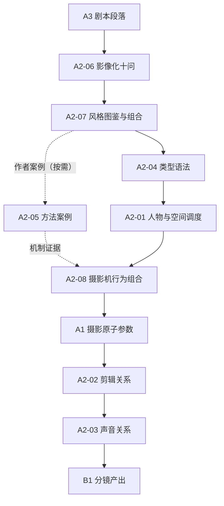
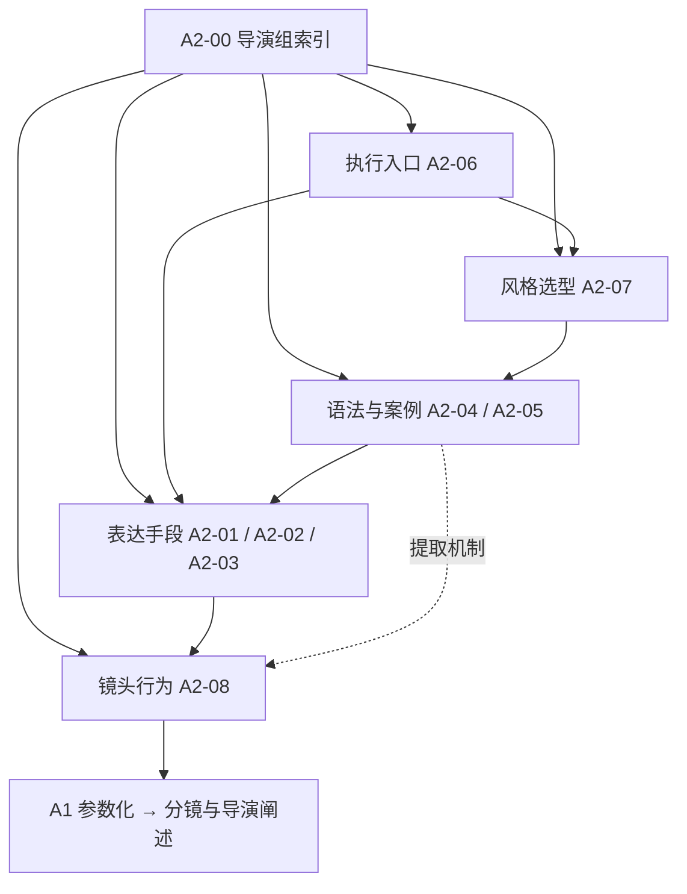

# A2·导演组·索引
> 用途（导航）：A2-导演组全部卡片的分类导航、使用路径与组内图谱。辨认与组合影像媒介、制作工艺、渲染、电影流派、类型和世界观风格，以及做分镜设计、导演阐述、剪辑与声音策略时的入口。本组由旧 09 区导演侧卡（09-04/09/10/11/12/13）与旧 11 区深度卡（11-05/11-06）纵向合并，并新增电影视觉风格总纲。

> [!workbench] 导演台｜组织关系、信息与时间
> **先问戏，再问镜头。** 用 A2-06 确认影像动机，用 A2-01 组织人物与空间，用 A2-08 把目的翻译成摄影机行为，再到 A1 填写原子参数；A2-02/A2-03 控制信息和声音，交付格式到 B1。

---

## 使用路径

标准工作流（剧本段落 → 分镜产出）：



1. [[A2-06 剧本影像化检查表]] —— 10问逐条过，确认影像决策有叙事动机。
2. [[A2-07 电影视觉风格坐标系与术语总纲|A2-07 电影风格与题材视觉图鉴]] —— 先看图辨认制作外观、题材世界、美术与摄影气质，再选择或组合成片方向。
3. [[A2-04 类型片语法]] —— 锁定类型影像语法基准；速查层定基调，深度层取原理与AI转化。
4. [[A2-01 调度与场面调度]] —— 用30种关系站位、权力转移、群像组织与双通道空间图，组织人物走位、轴线和信息显露顺序。
5. [[A2-08 镜头语言机制与摄影机行为]] —— 把叙事目的组合成“景别 × 机位 × 视点 × 运动 × 光学 × 时间采样”；需要作者证据时再查 [[A2-05 导演与摄影指导风格]]，不得用人名或片名代替机制。
6. 摄影参数细化 —— 进入[[A1-00 摄影组·索引|A1-摄影组]]的景别、机位/覆盖、运镜、构图、光学/焦点/时间采样、光影和色彩各卡。
7. [[A2-02 剪辑表达]] + [[A2-03 声音与音乐]] —— 定剪辑节奏与声音策略，再进入[[B1-00 分镜产出组·索引|B1-分镜产出组]]。

提示词落地出口：
- 即梦措辞：见 [[B3-13 即梦运镜光影术语完整词库]]，组入口 [[B3-00 平台实战组·索引]]
- 电影级参数母表：见 [[B2-09 电影级图片提示词Skill]]，组入口 [[B2-00 提示词工程组·索引]]

## 本组卡片列表（8张 + 本索引）

| 新ID | 标题 | 前身 | 用途 |
|------|------|------|------|
| A2-00 | [[A2-00 A2·导演组·索引\|A2·导演组·索引]] | 新写（参照 09-00 部分结构） | 组导航与使用路径 |
| A2-01 | [[A2-01 调度与场面调度\|调度与场面调度]] | 09-04 | 30种人物关系站位 + 22项调度要素 + 权力转移/作者案例/AI双通道 |
| A2-02 | [[A2-02 剪辑表达\|剪辑表达]] | 09-09 | 25种剪辑方式时间/空间/功能速查 |
| A2-03 | [[A2-03 声音与音乐\|声音与音乐]] | 09-10 | 26种声音元素来源/功能/心理效果速查 |
| A2-04 | [[A2-04 类型片语法\|类型片语法]] | 09-12（速查层）+ 11-06（深度层） | 11类速查 + 8类深度原理与AI四段转化 |
| A2-05 | [[A2-05 导演与摄影指导风格\|导演与摄影指导风格]] | 09-13（速查层）+ 11-05（深度层） | 21位作者/摄影指导协作案例；含杜琪峰群体岗位与静止蓄势机制，不直接模仿名号 |
| A2-06 | [[A2-06 剧本影像化检查表\|剧本影像化检查表]] | 09-11 | 10条逐项检查清单 + 执行顺序链（唯一出处） |
| A2-07 | [[A2-07 电影视觉风格坐标系与术语总纲\|电影风格与题材视觉图鉴]] | 重写 | 制作外观、题材世界、影史美术、摄影质感、口语风格译码、48组组合配方与实图画廊 |
| A2-08 | [[A2-08 镜头语言机制与摄影机行为\|镜头语言机制与摄影机行为]] | 新写 | 镜头六轴组合、覆盖设计、运动几何、光学与时间采样的场景级翻译台 |

## 组内图谱



```
⚫ A2-00 导演组索引
├─ 执行入口：A2-06 检查表（每次必过）
├─ 风格选型：A2-07 视觉图鉴（风格家族 + 题材 + 组合效果）
├─ 语法案例：A2-04 类型片 / A2-05 作者与摄影协作案例
├─ 表达组织：A2-01 调度 / A2-02 剪辑 / A2-03 声音
└─ 镜头行为：A2-08 六轴组合（场景翻译台） → A1 原子参数

· A2-06 先接 A2-07 完成视觉选型与组合，再调用类型、调度及 A1 摄影各卡
· A2-07 负责看图选风格和组合入口，不重复吞并 A2-04/05、A1 或 B2 的专项内容
· A2-08 负责把叙事目的翻译为摄影机行为组合；A1 负责各轴原子参数的定义和边界
· A2-04 / A2-05 提供类型语法与作者案例，出口需先转译为 A2-08 可观察机制
· A2-05 深度层案例与 A2-04 类型深度层互为印证（同源影片）
```

## 上下游关系

- **上游**：[[A3-00 A3·编剧组·索引|A3-编剧组]] —— 剧本结构、场景目标、人物弧光先行；本组回答"怎么拍"，不回答"讲什么"。
- **平级**：[[A1-00 摄影组·索引|A1-摄影组]] —— 景别、角度、运镜、构图、焦段、光影、色彩等镜头级参数在 A1；本组管视觉风格选型、场面级与叙事级决策（媒介/工艺/类型/流派/调度/剪辑/声音）。
- **下游**：[[B1-00 分镜产出组·索引|B1-分镜产出组]] —— 本组理论经检查表约束后落成分镜；AI 提示词化经 [[B2-00 提示词工程组·索引|B2-提示词工程组]]、平台措辞经 [[B3-00 平台实战组·索引|B3-平台实战组]]。
