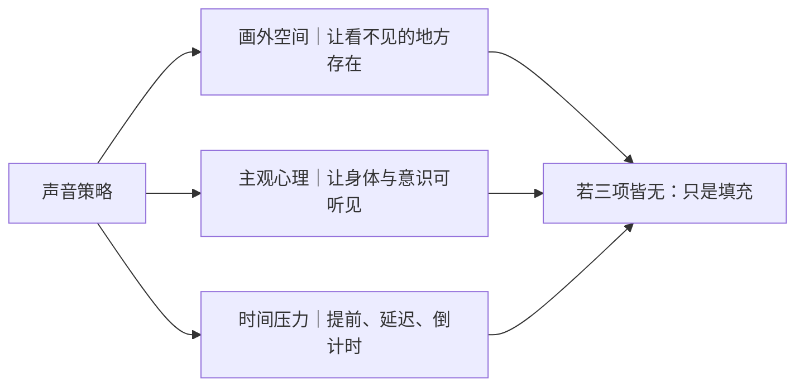

# 声音与音乐
> 用途（速查）：26种声音元素的来源、功能、心理效果与经典案例速查。设计声音时根据空间建立、主观心理和时间压力选择声音策略。

## 声音速查表

表中"心理效果"为常见倾向（如低频≈压迫、音乐主题≈情绪记忆），效果取决于上下文，非机械对应。

| 声音 | 来源 | 功能 | 心理效果 | 案例 |
|---|---|---|---|---|
| 环境声 | 场景自然声 | 建立空间 | 真实、沉浸 | 纪录片、现实主义 |
| 低频轰鸣 | 机械/配乐/环境 | 暗示不可见威胁 | 身体压迫 | 《敦刻尔克》《银翼杀手2049》 |
| 心跳声 | 主观身体声 | 主观紧张 | 焦虑、恐惧 | 惊悚、战争 |
| 呼吸声 | 人物身体 | 贴近身体压力 | 临场、脆弱 | 《地心引力》 |
| 无声处理 | 删除或压低声场 | 创伤、震惊 | 失重、隔离 | 爆炸后失聪段落 |
| 声音先行 | 下一事件先以声出现 | 提前制造期待 | 悬念 | J-cut |
| 声音延迟 | 画面先到声音后到 | 创伤或主观错位 | 不真实感 | 战争爆炸后 |
| 声音桥 | 声音连接场景 | 转场、主题连接 | 连续感 | 《现代启示录》 |
| 音乐主题 | Leitmotif | 角色/理念主题 | 记忆、命运 | 《星球大战》《教父》 |
| 战争耳鸣 | 主观高频 | 爆炸冲击 | 创伤、失控 | 《拯救大兵瑞恩》 |
| 深海压迫声 | 低频、水压、闷声 | 空间压迫 | 呼吸困难 | 潜艇/深海片 |
| 机械低频 | 引擎、液压、金属 | 机器存在感 | 非人性、重量 | 《异形》《终结者2》 |
| AI声音设计 | 合成、人声变形 | 非人性智能 | 熟悉又陌生 | 《2001》HAL、《她》 |
| 广播声 | 画内扬声器 | 制度、公共信息 | 冷漠、控制 | 灾难、战争 |
| 警报声 | 警示系统 | 倒计时、危机 | 紧迫 | 《异形》 |
| 雨声 | 环境 | 隔绝、清洗、忧郁 | 孤独 | 黑色电影、王家卫 |
| 海浪声 | 自然 | 边界、命运、时间 | 宁静或威胁 | 战争登陆、海难 |
| 金属摩擦 | 物理材质 | 危险、疼痛 | 不适 | 恐怖、工业科幻 |
| 液压声 | 机械动作 | 重量、系统 | 压迫 | 机甲、飞船 |
| 爆炸后失聪 | 主观音效 | 创伤瞬间 | 时间暂停 | 战争片 |
| 人群噪声 | 群体 | 社会压力 | 淹没个体 | 史诗、灾难 |
| 远处战斗声 | 画外空间 | 扩大世界 | 不安、不可见危险 | 战争片 |
| 画外声 | Offscreen sound | 暗示画外空间 | 悬念 | 惊悚 |
| 旁白 | Voice-over | 主观解释、记忆 | 亲密或不可靠 | 黑色电影、王家卫 |
| 沉默 | Silence | 暂停或拒绝音乐 | 紧张、哀悼 | 《老无所依》 |
| 主客观声音转换 | 从心理声到环境声 | 标记意识变化 | 代入/抽离 | 战争、惊悚 |

## 逐项声音视觉速认

> [!visual-note] 使用边界
> 下列 26 张图为本知识库制作的**原创视觉示意**，用于辨认波形、频谱、空间声场和声画时间关系；它们不是声学测量、频谱实测或心理效应实证。每项效果仍须结合具体场景、混音响度与播放环境判断。

### 环境声｜Ambient Sound

[Image omitted from the public edition pending source and reuse-rights verification.]

### 低频轰鸣｜Low-Frequency Rumble

[Image omitted from the public edition pending source and reuse-rights verification.]

### 心跳声｜Heartbeat

[Image omitted from the public edition pending source and reuse-rights verification.]

### 呼吸声｜Breathing

[Image omitted from the public edition pending source and reuse-rights verification.]

### 无声处理｜Silence Treatment

[Image omitted from the public edition pending source and reuse-rights verification.]

### 声音先行｜Sound Pre-Lap / J-Cut

[Image omitted from the public edition pending source and reuse-rights verification.]

### 声音延迟｜Delayed Sound

[Image omitted from the public edition pending source and reuse-rights verification.]

### 声音桥｜Sound Bridge

[Image omitted from the public edition pending source and reuse-rights verification.]

### 音乐主题｜Leitmotif

[Image omitted from the public edition pending source and reuse-rights verification.]

### 战争耳鸣｜War Tinnitus

[Image omitted from the public edition pending source and reuse-rights verification.]

### 深海压迫声｜Deep-Sea Pressure Sound

[Image omitted from the public edition pending source and reuse-rights verification.]

### 机械低频｜Mechanical Low Frequency

[Image omitted from the public edition pending source and reuse-rights verification.]

### AI声音设计｜AI Voice Design

[Image omitted from the public edition pending source and reuse-rights verification.]

### 广播声｜Broadcast Sound

[Image omitted from the public edition pending source and reuse-rights verification.]

### 警报声｜Alarm Sound

[Image omitted from the public edition pending source and reuse-rights verification.]

### 雨声｜Rain Sound

[Image omitted from the public edition pending source and reuse-rights verification.]

### 海浪声｜Ocean Waves

[Image omitted from the public edition pending source and reuse-rights verification.]

### 金属摩擦｜Metal Scrape

[Image omitted from the public edition pending source and reuse-rights verification.]

### 液压声｜Hydraulic Sound

[Image omitted from the public edition pending source and reuse-rights verification.]

### 爆炸后失聪｜Post-Blast Deafness

[Image omitted from the public edition pending source and reuse-rights verification.]

### 人群噪声｜Crowd Noise

[Image omitted from the public edition pending source and reuse-rights verification.]

### 远处战斗声｜Distant Battle Sound

[Image omitted from the public edition pending source and reuse-rights verification.]

### 画外声｜Offscreen Sound

[Image omitted from the public edition pending source and reuse-rights verification.]

### 旁白｜Voice-Over

[Image omitted from the public edition pending source and reuse-rights verification.]

### 沉默｜Silence

[Image omitted from the public edition pending source and reuse-rights verification.]

### 主客观声音转换｜Subjective–Objective Sound Shift

[Image omitted from the public edition pending source and reuse-rights verification.]

## 声音设计铁律

声音应该补充至少一项：画外空间 / 主观心理 / 时间压力。三者都没有的声音只是填充。
