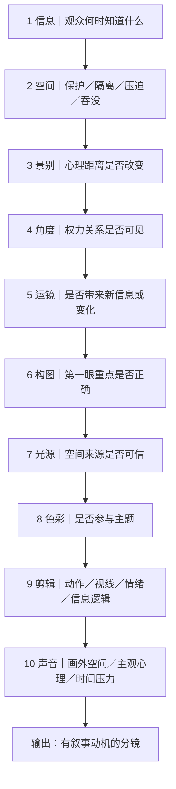

# 剧本影像化检查表

> **公开图像说明：** 原资料中未完成再分发权核验的图片不进入公开仓库；本页只显示已登记的原创公共图示。详见 [视觉资产登记](../../../docs/VISUAL_ASSETS.md)。
> 用途（对照执行）：将剧本段落转化为影像的10条逐项检查清单。每次做分镜或导演阐述时，逐条回答确保影像决策有叙事动机。检查表与执行顺序链以本卡为唯一出处。

## 十步检查清单

1. 这场戏的核心不是"发生了什么"，而是"观众应该在什么时候知道什么"。

2. 人物是被空间保护、隔离、压迫，还是吞没？

3. 景别是否随着人物心理距离改变？

4. 角度是否表达权力关系，而不只是好看？

5. 运镜是否带来新信息、心理变化或空间变化？

6. 构图是否让观众第一眼看到正确重点？

7. 光源是否来自可信空间？若不可信，是否有风格理由？

8. 色彩是否参与主题，而不是统一套滤镜？

9. 剪辑是否保持动作、视线、情绪和信息逻辑？

10. 声音是否补充画外空间、主观心理或时间压力？

## 执行顺序链

剧本段落影像化时按此顺序思考：

人物处境 → 空间关系 → 情绪距离 → 信息显露顺序 → 镜头尺度 → 角度与运动 → 光色与声音 → 剪辑节奏

各环节的参数细节：镜头尺度/角度/运动/构图/焦段/光影/色彩见 A1-摄影组各卡；调度见本组《调度与场面调度》，剪辑见本组《剪辑表达》，声音见本组《声音与音乐》。
