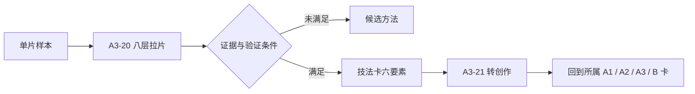

# A3·编剧组·索引
> 用途（导航）：A3-编剧组全部卡片的分类导航。写剧本/改剧本/拉片分析/技法蒸馏时从这里进入。本组由旧 10-剧本创作区 25 张卡迁建而来（含三对合并），编号连续、无空号。

> [!workbench] 编剧台｜把主题压进人物选择
> **取用顺序**　先诊断问题，再补人物与压力链，最后处理对白、留白与影像化接口。拉片样本不独立建馆；验证后的规则回到它所属的摄影、导演、编剧或实战卡。

---

## 五子组结构

| 子组 | 卡片 | 管什么 |
|------|------|--------|
| 诊断与启动 | A3-01 ~ A3-05 | 判断问题在哪 + 从灵感压出故事种子 |
| 人物 | A3-06 ~ A3-09 | 主角/反派/配角的成立、弧光、保护动作 |
| 结构 | A3-10 ~ A3-14 | 六节点压力链、开场结尾、转折高潮、场景取舍与进出 |
| 对白与情绪外化 | A3-15 ~ A3-17 | 对白目的与潜台词、情绪翻译成动作与物件、留白克制 |
| AI味与拉片转化 | A3-18 ~ A3-22 | 识别并去除AI味、拉片蒸馏技法、转创作、转分镜接口 |

---

## 快速路径

| 需求 | 直达卡片 |
|------|---------|
| 剧本卡住了，诊断问题 | A3-01 剧本创作核心公式 |
| 判断一段戏有没有戏剧功能 | A3-02 通用诊断六问 |
| 戏太平，需要加冲突 | A3-03 冲突设计四缺补全法 |
| 主题悬浮，角色像在说教 | A3-04 主题落地：逼进两难动作 |
| 从一个想法生成故事 | A3-05 灵感压入法 |
| 人物扁平像标签 | A3-06 人物成立法则 |
| 设计人物成长线 | A3-07 人物弧光与缺陷 |
| 让人物更像真人 | A3-08 人物保护动作 |
| 设计反派和配角 | A3-09 反派与配角设计 |
| 检查剧本整体结构 | A3-10 结构压力链：六节点升级 |
| 写开场或结尾 | A3-11 开场钩子与结尾回收 |
| 设计转折或高潮 | A3-12 转折与高潮设计 |
| 判断一场戏该不该删 | A3-13 场景删除测试 |
| 设计场景进出口 | A3-14 场景进出点设计 |
| 对白像念稿子/太直白 | A3-15 对白：目的与潜台词 |
| 叙述全是心理描写/用物件承载感情 | A3-16 情绪外化：动作与物件 |
| 情绪给太满需要克制 | A3-17 留白与克制 |
| 检查文本是否像AI写的 | A3-18 AI味六病识别 |
| 改写AI味的文本 | A3-19 去AI味改写流程 |
| 分析一部优秀作品/提炼技法 | A3-20 拉片与技法蒸馏 |
| 把拉片结果变成创作方法 | A3-21 拉片转创作方法 |
| 剧本转分镜/镜头设计 | A3-22 剧本转分镜前置分析 |

---

## canonical 变化维度词表（全组统一口径）

剧本中一切"变化清单"（转折检查、场景检查、节点升级）统一从这六个维度取子集，不再各立术语：

**目标 / 关系 / 信息 / 情绪 / 选择 / 代价**

| 维度 | 含义 |
|------|------|
| 目标 | 人物追的东西变了，或推进/受挫（旧称"剧情"） |
| 关系 | 人物之间的信任/敌友/亲疏变了 |
| 信息 | 观众或人物知道了之前不知道的东西 |
| 情绪 | 情绪状态发生迁移 |
| 选择 | 面临的选项出现/消失/改变 |
| 代价 | 赌注变大，输掉的东西升级（旧称"风险"） |

各卡取用的子集与尺度：

| 使用处 | 子集 | 尺度 |
|--------|------|------|
| A3-12 转折三变 | 目标/关系/代价 | 节点级（一转折/二转折等结构节点） |
| A3-13 场景五变 | 目标/关系/信息/情绪/选择 | 场景级（每一场戏） |
| A3-10 六节点检查 | 按节点取用（一转折处即节点级三变） | 节点级 |

---

## 两条使用动线

### 创作流（从灵感到成品剧本）


```
创意/需求
    │
    ▼
A3-05 灵感压入法（从想法→故事种子）
    │
    ▼
A3-01 核心公式 + A3-02 诊断六问（搭建引擎；不足处用 A3-03 补冲突、A3-04 落主题）
    │
    ▼
A3-06~09 人物子组（人物成立/弧光/保护动作/反派配角）
    │
    ▼
A3-10~12 结构子组（六节点压力链/开场结尾/转折高潮）
    │
    ▼
A3-13~14 场景取舍（删除测试/进出点）
    │
    ▼
A3-15 对白（目的与潜台词）
    │
    ▼
A3-16~17 情绪外化与留白（动作/物件/克制）
    │
    ▼
A3-18~19 去AI味（六病诊断→三删三补改写）
    │
    ▼
A3-22 剧本转分镜前置分析 → 见 A1-摄影组《景别系统》《摄影机运动系统》
    │
    ▼
成品剧本/分镜/提示词（提示词侧见 B2-提示词工程组）
```

### 拉片流（从优秀作品中学习）



```
选定优秀作品
    │
    ▼
A3-20 拉片与技法蒸馏（八层流程→技法卡六要素）
    │
    ▼
A3-21 拉片转创作方法（只搬方法不搬剧情，输出七项创作方案）
    │
    ▼
回归创作流（技巧反哺 A3-01~A3-19 各模块，故事种子接 A3-05）
```

---

## 卡片列表（含前身对照）

| 新ID | 标题 | 前身（旧10区） |
|------|------|---------------|
| A3-00 | A3·编剧组·索引 | 10-00（重写，非迁移） |
| A3-01 | 剧本创作核心公式 | 10-01 |
| A3-02 | 通用诊断六问 | 10-02 |
| A3-03 | 冲突设计四缺补全法 | 10-03 |
| A3-04 | 主题落地：逼进两难动作 | 10-04 |
| A3-05 | 灵感压入法 | 10-20 |
| A3-06 | 人物成立法则 | 10-05 |
| A3-07 | 人物弧光与缺陷 | 10-06 |
| A3-08 | 人物保护动作 | 10-07 |
| A3-09 | 反派与配角设计 | 10-08 |
| A3-10 | 结构压力链：六节点升级 | 10-09 |
| A3-11 | 开场钩子与结尾回收 | 10-10 |
| A3-12 | 转折与高潮设计 | 10-11 |
| A3-13 | 场景删除测试 | 10-12 |
| A3-14 | 场景进出点设计 | 10-13 |
| A3-15 | 对白：目的与潜台词 | 10-14 + 10-15 合并 |
| A3-16 | 情绪外化：动作与物件 | 10-16 + 10-17 合并（10-21 早前已并入 10-16） |
| A3-17 | 留白与克制 | 10-22 |
| A3-18 | AI味六病识别 | 10-18 |
| A3-19 | 去AI味改写流程 | 10-19 |
| A3-20 | 拉片与技法蒸馏 | 10-23 + 10-24 合并 |
| A3-21 | 拉片转创作方法 | 10-25 |
| A3-22 | 剧本转分镜前置分析 | 10-28 |

**旧编号真空说明**：旧10区的 10-21 已于 2026-07-05 并入 10-16（随之进入 A3-16）；10-26、10-27 为从未启用的空号。新组采用连续编号 A3-00 ~ A3-22，不保留空号概念。

---

## 统一口径备忘

- **术语**：人物驱动力统一为「欲望（想要）」，首现标注后简称「欲望」（见 A3-01）。
- **变化维度**：一律引用本索引的 canonical 词表，各卡只取子集并注明尺度。
- **技法卡 schema**：全库唯一一套「技法卡六要素」（名称/来源/原理/复用规则/正例/反例），定义在 A3-20。
- **跨组接口**：A3-22 是编剧组→摄影组（A1）/提示词工程组（B2）的接口卡。
