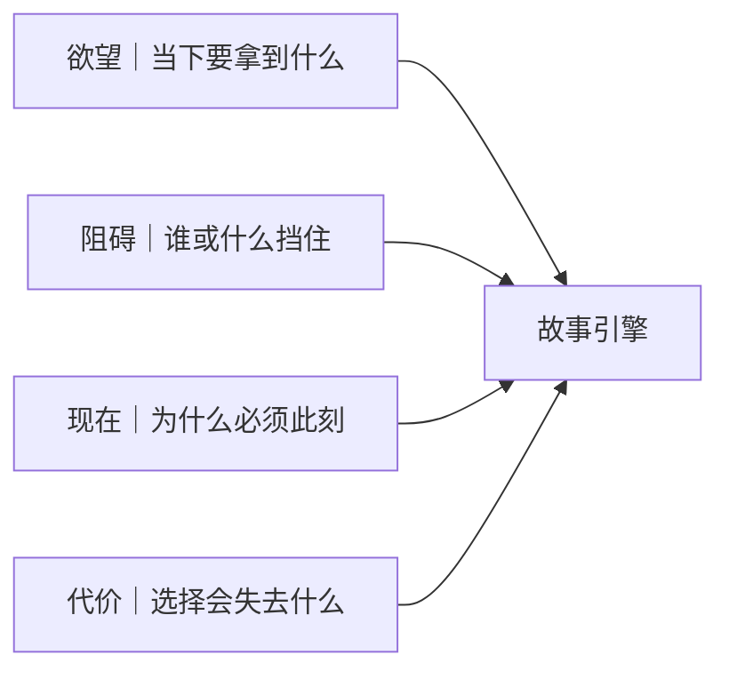

# 剧本创作核心公式
> 用途（速查）：创作/修改剧本时的核心判断公式。任何时候剧本卡住，先用这四个要素逐项检查。

## 公式

**欲望（想要）+ 阻碍 + 现在 + 代价 = 故事引擎**

> 术语说明：本组统一用「欲望（想要）」指人物当下要拿到的具体东西，后文简称「欲望」。

缺任何一个要素，就不是故事，只是"情况说明"。

## 四要素判定

| 要素 | 检查问题 | 不通过的标志 |
|------|---------|------------|
| 欲望 | 他当下要拿到什么？ | 只有"他想成为…""他梦想…"，没有具体目标 |
| 阻碍 | 谁或什么挡住他？ | 障碍太模糊（"命运""社会"），缺具体对手 |
| 现在 | 为什么必须现在行动？ | 没有时间压力或后果倒计时 |
| 代价 | 他选A会失去什么？ | 选择不痛，两个选项可以共存 |

## 对照示例

| 要素 | ❌ 不是故事 | ✅ 是故事 |
|------|-----------|---------|
| 欲望 | 他想成功 | 他要在48小时内找到失踪女儿 |
| 阻碍 | 社会环境不好 | 前妻已报警说孩子在他手上 |
| 现在 | 总有一天 | 再过48小时警方就立案 |
| 代价 | 没有代价 | 说真相→失去抚养权，不说→蹲监狱 |

## 使用的三步法

1. 摘出原文最空的一句
2. 问它缺什么（欲望/阻碍/现在/代价）
3. 补完后再问：下一场戏是否因此更容易发生？

如果补完后仍然只能得到一句总结，说明材料还没进剧本，继续压到场景和动作。
