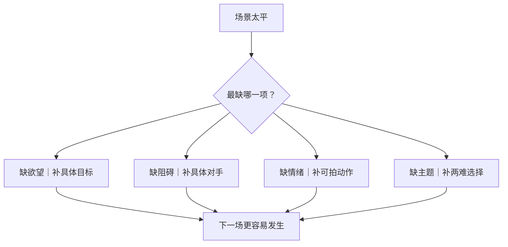

# 冲突设计四缺补全法
> 用途（速查）：戏太平、没有张力时，用四个问题逐项补冲突。适用于任何场景。

## 四缺逐项补

| 缺什么 | 补法 | 示例 |
|--------|------|------|
| 缺欲望 | "他现在要拿到什么？" | 不是"他想要认可"，是"他要让组长在晨会上点头" |
| 缺阻碍 | "谁或什么挡住他？" | 不是"社会偏见"，是"同事故意给了错误数据" |
| 缺情绪 | "他手上正在做什么？" | 不是"他很焦虑"，是"他把笔帽反复拔开又盖上" |
| 缺主题 | "他在两个坏选择里选了哪一个？" | 不是"善战胜恶"，是"举报朋友→失去信任，不举报→良心不安" |

## 使用流程

1. 摘出场景中最空的一句
2. 对照四缺，找出最缺的那一项
3. 用补法填上——必须是可拍的动作或可见的物件
4. 检验：补完后下一场戏是否更容易发生？

## 警告

不是每个场景都要四缺全补。轻场景（过渡/信息交代）用轻冲突，重场景（转折/高潮/人物选择）才全补。所有场景都塞冲突等于所有场景都不重要。
