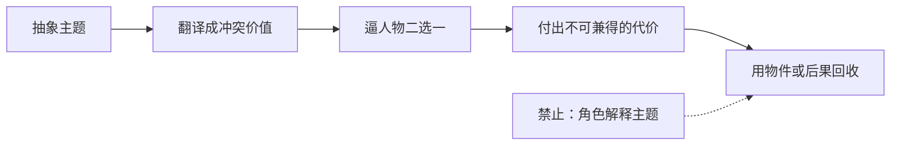

# 主题落地：逼进两难动作

> **公开图像说明：** 原资料中未完成再分发权核验的图片不进入公开仓库；本页只显示已登记的原创公共图示。详见 [视觉资产登记](../../../docs/VISUAL_ASSETS.md)。
> 用途（速查）：当剧本读完感觉"说教"或"主题悬浮"，把抽象主题压成具体两难选择。

## 核心原则

主题只能通过人物选择落地，不能让角色直接背诵。

## 落地三步

| 步骤 | 操作 | 错误做法 |
|------|------|---------|
| 1 | 把主题翻译成两个冲突的价值观 | "生命可贵" → "救规则还是救人" |
| 2 | 给人物一个不能两全的动作 | 让他必须在两个坏选项里选一个 |
| 3 | 用物件或后果回收，不解释 | 选完后只拍他做了什么，不让他说感受 |

## 对照

| 主题 | ❌ 口号式 | ✅ 动作式 |
|------|---------|---------|
| 生命可贵 | 角色说"每个生命都值得尊重" | 医生把备用电池从孩子楼层拿走——婴儿保温箱停电了 |
| 正义 | 角色说"正义也许会迟到但不会缺席" | 律师烧掉唯一证据，因为证据公开后证人全家会死 |
| 勇气 | 角色说"勇敢面对" | 他把举报信塞进碎纸机又伸手挡住——来回三次 |

## 逐项视觉：主题必须变成不可兼得的动作

### 生命可贵：唯一资源逼出价值冲突

> **文字化视觉示例：** 生命可贵两难：医生手中只有一块备用电源，两个方向无法同时获救。

### 正义：公开真相与保护证人不能同时成立

> **文字化视觉示例：** 正义两难：律师在提交唯一证据与销毁它保护证人之间做出不可逆选择。

### 勇气：身体先做出选择，再让代价显现

> **文字化视觉示例：** 勇气两难：举报信已进入碎纸机，人物伸手拦住但也暴露了自己。

> [!info] 视觉边界
> 以上为本任务制作的原创教学示意，用于识别“冲突价值—不可兼得动作—可见代价”的关系；它们不是医疗、法律或举报程序建议，也不是特定影片复刻。

## 检验标准

改完问自己：如果删掉所有旁白和内心独白，观众还能不能理解主题？能 → 落地成功。不能 → 主题还在天上。
