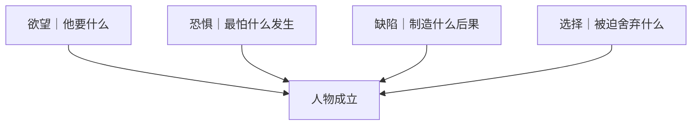

# 人物成立法则
> 用途（速查）：人物扁平、像标签时，按此法则重新开掘人物。

## 核心原则

人物通过**欲望、恐惧、缺陷和选择**成立，不通过作者评价成立。

## 四柱检查

| 柱 | 检查问题 | ❌ 不成立 | ✅ 成立 |
|----|---------|---------|--------|
| 欲望 | 他当下想要什么？ | "想被认可/想幸福"（太抽象） | "要让组长在晨会上点头"（可拍） |
| 恐惧 | 他最怕什么发生？ | "怕失败"（太笼统） | "怕女儿发现自己不是亲生的"（具体） |
| 缺陷 | 缺陷制造了什么后果？ | "性格急躁"（只是描述） | "因为急躁打断了关键对话，丢了情报"（有后果） |
| 选择 | 他被迫在什么之间选？ | 没得选 | "救搭档还是完成使命" |

### 欲望｜他要什么

[Image omitted from the public edition pending source and reuse-rights verification.]

### 恐惧｜最怕什么发生

[Image omitted from the public edition pending source and reuse-rights verification.]

### 缺陷｜制造什么后果

[Image omitted from the public edition pending source and reuse-rights verification.]

### 选择｜被迫舍弃什么

[Image omitted from the public edition pending source and reuse-rights verification.]

## 开掘人物的第一个问题

不要先问"他是什么性格"。

先问：**"他为了保住某样东西，愿意牺牲什么，又绝对不愿牺牲什么？"**

[Image omitted from the public edition pending source and reuse-rights verification.]

能回答这个问题 → 人物已经成立了大半。

## 避坑

- 不要用"善良、坚强、冷酷、复杂"这类评价性词语描述人物
- 不要说"他是一个…的人"——用行动说
- 缺陷必须制造剧情后果，不能只是性格标签

[Image omitted from the public edition pending source and reuse-rights verification.]
