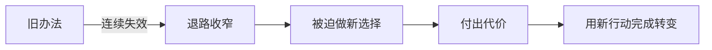

# 人物弧光与缺陷
> 用途（速查）：设计人物成长线时，确保弧光不靠"顿悟独白"，而是靠选择和代价完成。

## 弧光公式

**旧办法失效 → 被迫做新选择 → 付出代价 → 完成转变**

弧光不是"他变好了"。弧光是"他原来的活法走不通了，被迫换了一种，并且付出了代价"。

### 弧光前半｜旧办法连续失效

[Image omitted from the public edition pending source and reuse-rights verification.]

### 弧光后半｜代价逼出新选择

[Image omitted from the public edition pending source and reuse-rights verification.]

## 缺陷设计三原则

| 原则 | 说明 | ❌ 错误 | ✅ 正确 |
|------|------|--------|--------|
| 缺陷必须是行动障碍 | 缺陷让他做不成某件具体的事 | "他性格孤僻" | "他因为不接电话错过了救援信号" |
| 缺陷必须被推到极端 | 在关键时刻逼他面对 | 从头到尾都孤僻 | 平时孤僻没事，但生死关头必须开口求助 |
| 缺陷的修复必须付出代价 | 学会沟通时已经失去了重要的人 | 一沟通就好了 | 学会沟通时，对方已经不再需要了 |

### 缺陷是行动障碍

[Image omitted from the public edition pending source and reuse-rights verification.]

### 把缺陷推到极端

[Image omitted from the public edition pending source and reuse-rights verification.]

### 修复必须付出代价

[Image omitted from the public edition pending source and reuse-rights verification.]

## 对照示例

| 阶段 | ❌ 假弧光 | ✅ 真弧光 |
|------|---------|---------|
| 起点 | 胆小的人 | 只相信自己的人 |
| 转折 | 突然勇敢了 | 必须把密码告诉搭档才能救孩子→说了 |
| 代价 | 没有 | 搭档之后可以随时查他底细 |
| 终点 | "我变勇敢了" | 他主动把备用钥匙放在搭档桌上，没有解释 |

## 弧光检验

改完后问：如果删掉那段"我终于明白…"的独白，观众还能看见人物变了吗？能通过他的新动作判断吗？不能 → 弧光是台词贴上去的。

[Image omitted from the public edition pending source and reuse-rights verification.]
