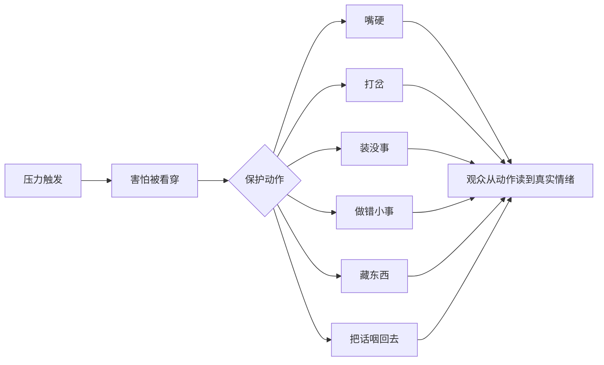

# 人物保护动作：不体面的真

> **公开图像说明：** 原资料中未完成再分发权核验的图片不进入公开仓库；本页只显示已登记的原创公共图示。详见 [视觉资产登记](../../../docs/VISUAL_ASSETS.md)。
> 用途（速查）：让人物从"像机器人"变成"像真人"的最快方法——给他一个不体面的保护动作。

## 核心原理

真人不是在每时每刻都"得体"。真人在压力下会：撒谎、拖延、嘴硬、装没事、把重要物件藏起来、把话咽回去。

给角色一个**不太体面的保护动作**，他立刻从标签变成人。

## 保护动作类型速查

| 类型 | 动作示例 | 适用情境 |
|------|---------|---------|
| 嘴硬 | 明明手在抖，说"我不冷" | 受伤/害怕但不愿示弱 |
| 打岔 | 被问到痛处时突然问"你吃饭了吗" | 被戳到羞耻点 |
| 装没事 | 把碎掉的相框翻过来正面朝下 | 刚失去重要东西 |
| 做错小事 | 倒水时倒满了，擦桌子擦了三遍还在擦 | 内心崩溃但表面平静 |
| 藏东西 | 把体检报告塞进抽屉最底层 | 隐瞒真相 |
| 咽回去 | "你知不知道——算了。" | 想说但不敢说 |

## 逐项视觉：动作把隐藏情绪变成可见证据

### 嘴硬：身体已经承认，语言仍在否认

> **文字化视觉示例：** 嘴硬：明明发冷仍拒绝帮助，身体状态与口头否认形成冲突。

### 打岔：用无关动作逃离真正的问题

> **文字化视觉示例：** 打岔：人物转向炉灶和锅具，把注意力从痛处移开。

### 装没事：处理物件，回避情绪

> **文字化视觉示例：** 装没事：人物把相框翻扣后继续吃饭，用日常动作压住失去。

### 做错小事：失控被转移到重复动作

> **文字化视觉示例：** 做错小事：水已经溢出，人物仍反复擦同一块桌面。

### 藏东西：隐藏真相的动作反而暴露恐惧

> **文字化视觉示例：** 藏东西：人物把报告压进抽屉深处，同时警惕身后的家人。

### 咽回去：话停在出口，未说内容成为表演

> **文字化视觉示例：** 咽回去：人物半抬手、避开视线，在开口前撤回表达。

> [!info] 视觉边界
> 以上为本任务制作的原创教学示意，用来识别“保护动作如何让潜台词可见”；它不是特定影片复刻，也不把单一表演当作唯一标准答案。

## 选择逻辑

根据人物缺陷选对应保护动作：
- 害怕被抛弃 → 先推开别人（嘴硬）
- 害怕被看穿 → 疯狂说废话（打岔）
- 害怕失控 → 做无意义的小事（做错小事）

## 使用规则

轻场景给一个，重场景给两个，但不要每个场景都用 → 否则变成套路。

对白侧的"打岔/咽回去"如何落进台词，见 A3-15《对白：目的与潜台词》的绕圈术。
