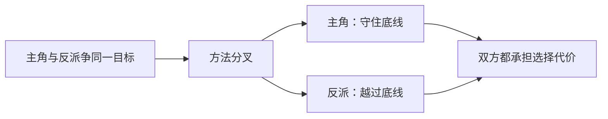

# 反派与配角设计
> 用途（速查）：设计反派和配角时，确保他们不是"工具人"而是有自己逻辑的人。

## 反派设计三问

| 问题 | ❌ 工具式反派 | ✅ 成立的反派 |
|------|------------|------------|
| 他想要什么？ | 搞破坏/统治世界 | 和主角想要同一件东西 |
| 他为什么觉得自己是对的？ | "因为我坏" | 他有自己的正义逻辑，只在方法上越界 |
| 他的选择有代价吗？ | 没有 | 他越接近目标，失去的越多 |

> [!visual-note] 读图边界
> 以下均为本库原创角色关系示意。箭头标的是本卡已有的目标、手段、代价与关系压力，不是固定人物公式。

### 逐项画面 · 反派设计三问

#### 01 · 他想要什么：同一目标，方法分叉
[Image omitted from the public edition pending source and reuse-rights verification.]

#### 02 · 他为什么觉得自己是对的：自洽正义与越线手段
[Image omitted from the public edition pending source and reuse-rights verification.]

#### 03 · 他的选择有代价吗：越接近目标，失去越多
[Image omitted from the public edition pending source and reuse-rights verification.]

## 反派成立优先检查项（多数情况适用，非绝对）

**反派是主角愿望的镜像：主角要A，反派也要A，只是手段不同。**

不是主角要拯救世界、反派要毁灭世界——那是标签打架。而是主角和反派都在乎同一件事，但选了相反的路。

#### 04 · 愿望镜像
[Image omitted from the public edition pending source and reuse-rights verification.]

## 配角生命感三问

| 问题 | ❌ 工具配角 | ✅ 有生命感的配角 |
|------|----------|----------------|
| 他有自己的欲望吗？ | 他的存在只为帮主角 | 他有和主线无关的小目标（哪怕不展开） |
| 他有不在场的时刻吗？ | 24小时待命 | 他提到过"我昨晚…"或"等我一下" |
| 他会对主角说不吗？ | 从不拒绝 | 至少有一个人说过"这次不行" |

### 逐项画面 · 配角生命感三问

#### 05 · 配角有自己的欲望
[Image omitted from the public edition pending source and reuse-rights verification.]

#### 06 · 配角有场外生活
[Image omitted from the public edition pending source and reuse-rights verification.]

#### 07 · 配角说“不”形成关系压力
[Image omitted from the public edition pending source and reuse-rights verification.]

## 群像人物速成法

不要给每个配角写背景故事，给每个配角**一个反常偏好**：
- 拆弹专家怕剪刀
- 厨师不吃自己做的菜
- 狙击手种多肉植物

一个偏好 = 一个人物，比一千字简历更有效。

#### 08 · 反常偏好制造人物记忆点
[Image omitted from the public edition pending source and reuse-rights verification.]
