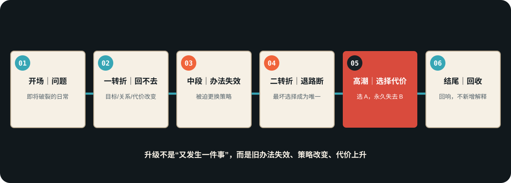
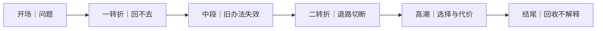

# 结构压力链：六节点升级
> 用途（速查）：检查剧本结构是否逐级升级，而非事件堆砌。对照六个节点逐项检查。

## 六节点压力链





```
开场     →  给问题，让观众知道人物缺什么
一转折    →  事件逼人物离开原生活，回不去了
中段     →  旧办法逐层失效，人物被迫学习
二转折    →  退路被彻底切断，只剩最坏选择
高潮     →  必须做选择并付代价，不能回头
结尾     →  回收前面的物件/关系/选择，不给解释
```

## 检查方法

| 节点 | 检查问题 | ❌ 没升级 | ✅ 升级了 |
|------|---------|---------|---------|
| 开场 | 人物缺什么、想要什么？ | 展示日常 | 展示一个即将破裂的日常 |
| 一转折 | 为什么回不去了？ | "又发生了一件事" | 事件至少改变了目标/关系/代价之一（节点级三变，见 A3-12） |
| 中段 | 旧办法怎么失效的？ | 同样的事反复发生 | 每次失效迫使人物换策略 |
| 二转折 | 退路怎么断的？ | 没有退路本来就没有 | 有个明确的退路选项突然消失 |
| 高潮 | 选择的代价是什么？ | 没有代价，或者代价很轻 | 选了A，永远失去B |
| 结尾 | 回收了什么？ | 新事件/新人物/解释 | 之前出现的物件/选择产生回响 |

节点处检查用的变化维度，统一取自 A3-00 索引的「变化维度词表」（目标/关系/信息/情绪/选择/代价）。

## 中段升级通用操作

每当你觉得"又发生了一件事"时，改成"这件事迫使人物改变策略"：
- ❌ 又有一波敌人来了 → ✅ 这波敌人用了主角的备用逃生路线
- ❌ 又发现一个新线索 → ✅ 新线索说明之前的判断全错了
