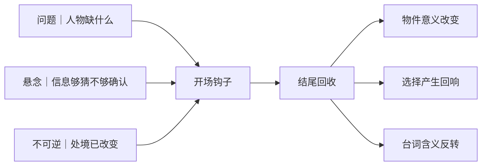

# 开场钩子与结尾回收
> 用途（速查）：检查开场的钩子力度和结尾的回收完整度。

## 开场钩子设计三要素

| 要素 | 含义 | ❌ 弱钩子 | ✅ 强钩子 |
|------|------|---------|---------|
| 问题 | 马上看到人物缺什么 | 先介绍一页世界观 | 第一个镜头就是人物做选择 |
| 悬念 | 让观众想知道"然后呢" | 交代一切 | 信息给到刚好够猜，不够确认 |
| 不可逆 | 事件发生后不能当没事 | 小事，可忽略 | 改变了人物处境/关系/目标 |

> [!visual-note] 视觉说明
> 以下均为本库原创情境图，不是电影截图，也不把单一例子当成普遍规律。图内编号、动线和“看点”用于把抽象概念落到可观察动作。

### 问题钩子｜从缺口直接进入行动

[Image omitted from the public edition pending source and reuse-rights verification.]

### 悬念钩子｜够猜但不能确认

[Image omitted from the public edition pending source and reuse-rights verification.]

### 不可逆钩子｜事件发生后不能复原

[Image omitted from the public edition pending source and reuse-rights verification.]

## 钩子检验

开场三分钟后，观众能不能回答这三个问题：
1. 这个人想要什么？（不需要说对，但要有猜测）
2. 为什么现在？（有什么在倒计时）
3. 如果他不做会怎样？（代价是什么）

## 结尾回收三大类

| 类型 | 怎么用 | 示例 |
|------|--------|------|
| 物件回收 | 开头出现的物件在结尾重新出现，意义变了 | 开场的戒指是求婚→结尾的戒指是遗物 |
| 选择回收 | 开头做的选择在结尾产生回响 | 开场选择隐瞒→结尾因为那个隐瞒失去一切 |
| 台词回收 | 一句对白被重新说出，含义反转 | "我会回来的"第一次是承诺，最后一次是说给墓碑听 |

### 物件回收｜同一物件，意义递进

[Image omitted from the public edition pending source and reuse-rights verification.]

### 选择回收｜早期选择产生后果

[Image omitted from the public edition pending source and reuse-rights verification.]

### 台词回收｜相同话语，含义反转

[Image omitted from the public edition pending source and reuse-rights verification.]

物件在场景内如何逐次承载情绪（一物三次出现），见 A3-16《情绪外化：动作与物件》。

## 结尾检验

- 结尾是往前看的还是往后看的？往前 → 有力。往后（解释/总结）→ 弱。
- 观众离开时想的是"他接下来会怎样"还是"哦原来是这样"？前者 → 好结尾。

### 前瞻型结尾｜把人物推向下一项行动

[Image omitted from the public edition pending source and reuse-rights verification.]
