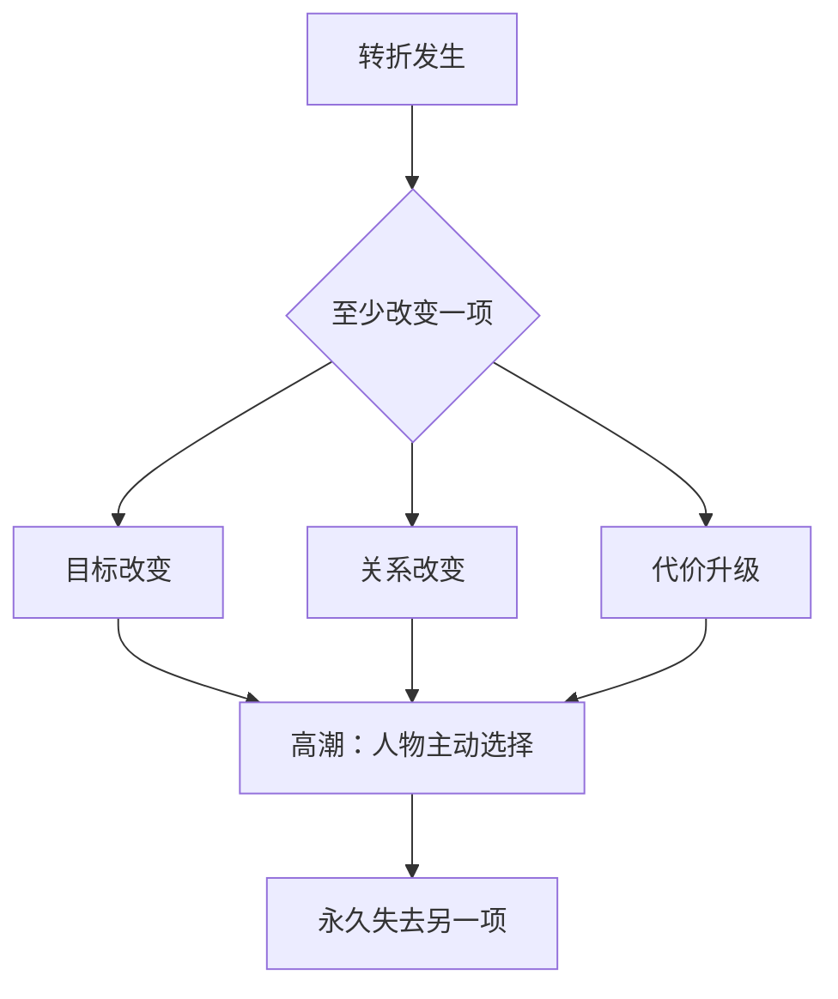

# 转折与高潮设计
> 用途（速查）：检查转折是否有分量，高潮是否把压力推到顶点。

## 转折三变法则

每一次转折必须至少改变以下三项之一。三变取自 A3-00 索引「变化维度词表」的子集：**目标/关系/代价**（节点级尺度；"代价"维度旧称"风险/赌注"，现统一并入"代价"）。

| 改变什么 | 含义 | 示例 |
|---------|------|------|
| 目标 | 人物不再追原来的东西 | 追凶手 → 发现自己才是被追的人 |
| 关系 | 盟友变对手或反过来 | 搭档坦白自己是卧底 |
| 代价 | 赌注变大，输掉的东西升级 | 输钱 → 输命 → 输灵魂 |

> [!visual-note] 视觉说明
> 以下均为本库原创情境图，不是电影截图，也不把单一例子当成普遍规律。图内编号、动线和“看点”用于把转折与高潮变成可观察动作。

### 目标改变｜停止旧追逐，改换行动

[Image omitted from the public edition pending source and reuse-rights verification.]

### 关系改变｜盟友站位变成对峙

[Image omitted from the public edition pending source and reuse-rights verification.]

### 代价升级｜损失从项目推到人和永久牺牲

[Image omitted from the public edition pending source and reuse-rights verification.]

如果转折只是"又发生了一件事"（更多敌人/更多困难/更多信息），它就不是转折。

## 高潮设计三问

| 问题 | ❌ 弱高潮 | ✅ 强高潮 |
|------|---------|---------|
| 人物做了选择吗？ | 被外力解决（天降神兵/巧合） | 人物主动做出不可逆的选择 |
| 付出了代价吗？ | 全身而退 | 选A，B永远没了 |
| 和开场呼应了吗？ | 无关 | 开场的问题在高潮用行动回答 |

### 主动不可逆选择｜决定由人物亲手完成

[Image omitted from the public edition pending source and reuse-rights verification.]

### 选 A，永久失去 B｜选择必须有代价

[Image omitted from the public edition pending source and reuse-rights verification.]

### 开场问题由行动回答｜人物变化要能被看见

[Image omitted from the public edition pending source and reuse-rights verification.]

## 高潮检验

把高潮场景中的所有台词删掉，只留动作——还能不能看懂？不能 → 高潮靠台词撑，不是靠动作。

### 无台词动作高潮｜只靠物件、身体和空间讲清选择

[Image omitted from the public edition pending source and reuse-rights verification.]
