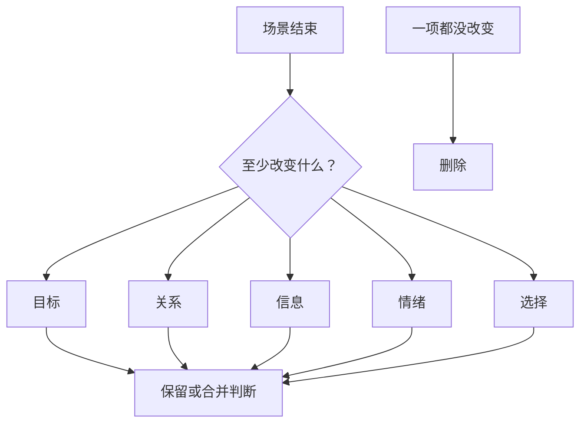

# 场景删除测试
> 用途（速查）：判断一场戏该不该删/合——做五变测试。五变缺一不可。

## 五变测试

每场戏结束后，至少改变以下**一项**。五变取自 A3-00 索引「变化维度词表」的子集：**目标/关系/信息/情绪/选择**（场景级尺度；"目标"维度旧称"剧情"，指故事往前走）。

| 改变什么 | 判断 | 示例 |
|---------|------|------|
| 目标 | 故事往前走了吗？人物目标推进或受挫了吗？ | 获得了新信息/失去了资源 |
| 关系 | 人物关系变了吗？ | 信任→怀疑 / 亲近→疏远 |
| 信息 | 观众知道了之前不知道的东西？ | 揭了一个秘密/埋了一个谜 |
| 情绪 | 情绪状态变了吗？ | 从平静→焦虑 / 从恨→爱 |
| 选择 | 人物面临的选择变了吗？ | 出现新选项 / 旧选项消失 |

## 删除测试

问自己：**删掉这场戏，故事少了什么？**

- 只少了一段说明 → 合并到相邻场景
- 少了一个选择/误会/证据/关系裂缝 → 这场戏有独立存在的理由
- 什么都没少 → 直接删

## 五变权重

不是每场戏要五变全满。按场景类型配权重：
- **重场戏**（转折/高潮）：至少四变
- **中场戏**（推进/揭示）：至少两变
- **轻场戏**（过渡/交代）：一变即可，但必须有一变
