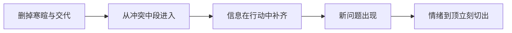

# 场景进入点与退出点

> **公开图像说明：** 原资料中未完成再分发权核验的图片不进入公开仓库；本页只显示已登记的原创公共图示。详见 [视觉资产登记](../../../docs/VISUAL_ASSETS.md)。
> 用途（速查）：设计每场戏的进出口时使用，避免每场都从头交代到结尾。

## 进入点规则

**尽量从冲突的中间进入，不要从"发生了什么事"开始。**

| ❌ 慢进入 | ✅ 快进入 |
|----------|---------|
| 人物进门→寒暄→坐下→倒水→开始说话 | 直接从中途对话进入，前因由后文补 |
| 先交代地点时间人物状态 | 第一句就是冲突或选择 |
| "今天天气不错"—"是啊"—"我找你有点事" | "你昨天说的事，我做不到" |

### 从冲突中段进入

> **文字化视觉示例：** 快进入：人物已在冲突中，门口阻挡与信封直接给出局面。

### 信息在行动中补齐

> **文字化视觉示例：** 行动中补信息：收拾行李没有停下，腕带从动作里暴露前因。

### 第一句就是冲突或选择

> **文字化视觉示例：** 第一句就是选择：钥匙已经递出，接不接受成为当前动作。

## 退出点规则

**停在新问题出现处，不要停在问题解决处。**

| ❌ 慢退出 | ✅ 快退出 |
|----------|---------|
| 问题解决→总结→"那就这样吧"→离开 | 新问题刚出现就切，留观众想"然后呢" |
| 所有信息交代完毕 | 最重要的信息留给下一场揭示 |
| 情绪释放完才结束 | 情绪刚到顶点就切 |

### 新问题出现就切

> **文字化视觉示例：** 新问题出现即切：来电刚亮，人物反应和后果都尚未完成。

### 最重要的信息留后揭示

> **文字化视觉示例：** 关键信息留后：文件已经打开，决定性页面仍被封住。

### 情绪到顶立刻切出

> **文字化视觉示例：** 情绪到顶切出：手已伸出但尚未拥抱，释放被延后。

## 进出检验

读你写的一场戏，抹掉第一段和最后一段：
- 还能懂吗？→ 进出点正确
- 不明白了？→ 你把太多交代堆在了头尾，需要重新分配信息进中段

> **文字化视觉示例：** 首尾删减测试：两端交代可删，中段冲突仍能独立成立。
