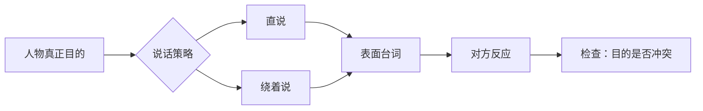

# 对白：目的与潜台词
> 用途（速查）：对白写不下去、像念稿子、太直白时用。目的论为纲：先定人物目的，再写句子；绕圈术为技：让人物绕着目的说话。

## 核心原则

- 每句对白背后都有一个目的。先定目的，再选策略，再写句子。
- 对白的重点常在没说出口的东西。对白不是信息传送带，而是人物用话保护自己、试探别人、争夺主动权。

## 核心流程

**定人物目的 → 选策略（直说还是绕）→ 写对白 → 检查**

## 对白目的速查（六种）

| 目的 | 特征 | 示例 |
|------|------|------|
| 获取信息 | 试探、套话 | "你上次见他是什么时候？" |
| 保护自己 | 否认、转移、撒谎 | "我不知道你在说什么" |
| 攻击对方 | 揭短、质疑、挑衅 | "你妈也是这么教你的？" |
| 维持体面 | 假装没事、轻描淡写 | "还行，就那样" |
| 争取时间 | 重复对方的话、反问 | "你问我爱不爱你？" |
| 掩饰羞耻 | 愤怒代替受伤、嘲笑代替羡慕 | "谁稀罕"（其实很稀罕） |

### 获取信息

[Image omitted from the public edition: 获取信息：问题只是诱饵，人物真正观察的是对方的视线. Source and reuse rights are pending verification.]

### 保护自己

[Image omitted from the public edition: 保护自己：明面推开证据，暗手藏住关键物. Source and reuse rights are pending verification.]

### 攻击对方

[Image omitted from the public edition: 攻击对方：旧证据被推到众人面前，话语目的指向伤害. Source and reuse rights are pending verification.]

### 维持体面

[Image omitted from the public edition: 维持体面：肩膀装作轻松，发抖的手藏在身后. Source and reuse rights are pending verification.]

### 争取时间

[Image omitted from the public edition: 争取时间：茶匙反复绕圈，视线先寻找时钟. Source and reuse rights are pending verification.]

### 掩饰羞耻

[Image omitted from the public edition: 掩饰羞耻：拒信藏在身后，用愤怒替代受伤. Source and reuse rights are pending verification.]

## 使用步骤

1. 拿到一场对话 → 先给每个角色写一句话的目的（不是台词，是目的）
2. 目的冲突 → 好戏。目的一致 → 这场对白可能不需要
3. 写对白时，让角色用一句话绕着目的走（绕法见下）

## 绕圈术五种

如果人物需要表达A，不直接说A，用以下方式绕：

| 绕法 | 操作 | 示例 |
|------|------|------|
| 问天气 | 说无关的话，让对方猜 | 想说"我担心你" → "今天降温了你知道吗" |
| 挑错字 | 抓住细枝末节发难 | 想说"你背叛了我" → "你上次说的不是三点半吗" |
| 提旧账 | 用过去的事攻击现在 | 想说"我不信你" → "上次你说这话的时候也是星期二" |
| 转移话题（打岔） | 被问到痛处时突然转向 | "你觉得我们还能继续吗？"—"你吃饭了吗" |
| 把话咽回去 | 说到一半停止 | "你知不知道——算了" |

### 问天气

[Image omitted from the public edition: 问天气：不说担心，只替对方系紧围巾. Source and reuse rights are pending verification.]

### 挑错字

[Image omitted from the public edition: 挑错字：人物死盯时间戳，借细节逃开更大的背叛. Source and reuse rights are pending verification.]

### 提旧账

[Image omitted from the public edition: 提旧账：旧照片被拿回当下，过去的伤口用来攻击现在. Source and reuse rights are pending verification.]

### 转移话题（打岔）

[Image omitted from the public edition: 打岔：痛处刚被问到，人物立刻转身收拾餐具. Source and reuse rights are pending verification.]

### 把话咽回去

[Image omitted from the public edition: 把话咽回去：手势已经抬起，话却在出口前撤回. Source and reuse rights are pending verification.]

"打岔""咽回去"同时也是人物在压力下的保护动作，人物侧用法只在 A3-08《人物保护动作》展开，此处只管台词写法。

## 去作文腔三步

1. **先删"我真正想说的是"** — 让人物绕着说
2. **允许断裂** — 真实对话会停顿、改口、被打断
3. **让对白做选择，不做总结** — "你走吧"比"我对你很失望"有力量

### 删掉直说，让动作承载真正的话

[Image omitted from the public edition: 删掉直说：备用钥匙代替“留下来”. Source and reuse rights are pending verification.]

### 允许断裂

[Image omitted from the public edition: 允许断裂：改口、打断与错开的视线共同制造压力. Source and reuse rights are pending verification.]

### 让对白做选择

[Image omitted from the public edition: 让对白做选择：钥匙与行李完成决定，不再总结情绪. Source and reuse rights are pending verification.]

## 真人对话特征

| ✅ 有 | ❌ 没有 |
|-------|--------|
| 被打断 | 每句都完整说完 |
| 重复 | 每句都有新信息 |
| 口癖（"就是…""那个…"） | 语法完美 |
| 误解对方意思 | 完全理解对方 |
| 答非所问 | 对答如流 |

### 被打断

[Image omitted from the public edition: 被打断：两人同时开口，抬手抢回话轮. Source and reuse rights are pending verification.]

### 重复

[Image omitted from the public edition: 重复：同一问题与同一手势不断累积压力. Source and reuse rights are pending verification.]

### 口癖与犹豫

[Image omitted from the public edition: 口癖与犹豫：手捻通知，嘴停在半句话. Source and reuse rights are pending verification.]

### 误解对方意思

[Image omitted from the public edition: 误解：礼物向前，对方的手却向后拒绝. Source and reuse rights are pending verification.]

### 答非所问

[Image omitted from the public edition: 答非所问：目光追问，剥橙子把回答移到别处. Source and reuse rights are pending verification.]

## 双重检验

- **目的检验**：遮住对白，只看你写的那行目的——能演吗？能 → 目的可拍。不能（如"他想表达爱意"）→ 目的太抽象，需要具体化。
- **声音检验**：把一段对白的说话人名字遮住，还能分辨谁在说话吗？不能 → 所有角色用同一张嘴在说话。
