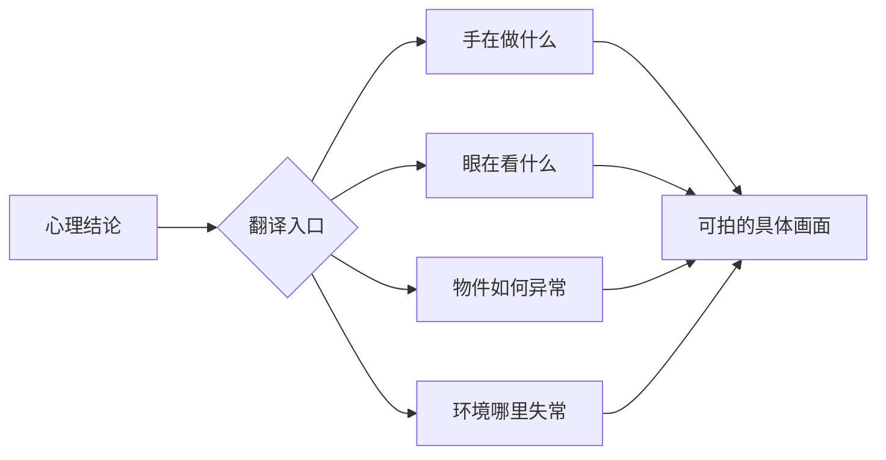

# 情绪外化：动作与物件
> 用途（速查）：叙述中出现"他很痛苦""场面压抑"等心理结论时用。翻译法为纲：心理结论翻译成可见的动作/物件/环境；物件映射与"一物三次出现"为物件侧技法。

## 翻译公式

**心理结论 → 手在做什么 / 眼在看什么 / 什么物件 / 什么环境**

## 翻译对照表

| 心理结论 | ❌ 直说 | ✅ 翻译 |
|---------|--------|--------|
| 很痛苦 | 他陷入深深的痛苦 | 他把杯子放到桌边三次都没放稳 |
| 很紧张 | 他紧张得手心出汗 | 他的拇指反复摁打火机，没有一次摁到底 |
| 很生气 | 她压抑着愤怒 | 她把咖啡杯推到桌子另一边，自己不喝也不让别人收 |
| 崩溃了 | 她终于崩溃了 | 她把手机翻过来扣在桌上，停了三秒，又把屏幕翻回来 |
| 很压抑 | 房间很压抑 | 空调坏了，窗户打不开，墙上的钟每走一下都卡半拍 |
| 关系破裂 | 他们的关系走到了尽头 | 两把钥匙放在玄关，一把被拿走，一把留在原地 |

### 很痛苦 → 杯子反复放不稳

[Image omitted from the public edition: 痛苦外化：湿痕记录反复放置，手的失准代替心理结论. Source and reuse rights are pending verification.]

### 很紧张 → 打火机始终没按到底

[Image omitted from the public edition: 紧张外化：拇指反复用力，打火机始终没有点燃. Source and reuse rights are pending verification.]

### 很生气 → 把咖啡推远

[Image omitted from the public edition: 愤怒外化：中性物件被推远，身体仍强行保持克制. Source and reuse rights are pending verification.]

### 崩溃了 → 手机翻扣又翻回

[Image omitted from the public edition: 崩溃外化：相反动作紧接发生，决定无法维持. Source and reuse rights are pending verification.]

### 很压抑 → 环境各处失常

[Image omitted from the public edition: 压抑外化：空调、窗户与时钟共同制造无法逃离的空间. Source and reuse rights are pending verification.]

### 关系破裂 → 两把钥匙分开

[Image omitted from the public edition: 关系破裂外化：一把钥匙被带走，另一把独自留在玄关. Source and reuse rights are pending verification.]

## 剧本动作侧：动作代替心理

**心理状态 → 一个正在做的动作 + 那个动作的异常状态**

| 心理状态 | ❌ 直说 | ✅ 用动作 |
|---------|--------|---------|
| 犹豫/挣扎 | 他心里斗争 | 他把报告从文件夹抽出来又推回去，来回三次 |
| 后悔 | 他后悔了 | 他把对方留下的杯子拿起来，擦了一遍又放回去 |
| 暗下决心 | 她下定了决心 | 她把咖啡倒掉，换成白水，一口喝完 |
| 不安 | 他感到不安 | 他在会议室门口站了很久，敲门时敲错了声数 |
| 释怀 | 他终于释怀了 | 他把带了三年的护身符从脖子上摘下来放桌上头也不回走了 |
| 注意力的变化 | 他开始在意她了 | 他接水时把她杯子里的茶渣倒掉了——以前从不 |

### 犹豫／挣扎

[Image omitted from the public edition: 犹豫外化：报告始终停在文件夹边缘，动作反复可逆. Source and reuse rights are pending verification.]

### 后悔

[Image omitted from the public edition: 后悔外化：人已离开，对留下杯子的照料仍在继续. Source and reuse rights are pending verification.]

### 暗下决心

[Image omitted from the public edition: 决心外化：倒掉咖啡、换成白水并一次喝完. Source and reuse rights are pending verification.]

### 不安

[Image omitted from the public edition: 不安外化：门前停留过久，抬手动作迟疑失序. Source and reuse rights are pending verification.]

### 释怀

[Image omitted from the public edition: 释怀外化：护身符留在前景，人物不回头离开. Source and reuse rights are pending verification.]

### 注意力的变化

[Image omitted from the public edition: 注意力变化：不被要求地清理对方杯中茶渣. Source and reuse rights are pending verification.]

三步法：

1. 找到心理描写的词（"他感到…""他意识到…""他决定…"）
2. 问：他手上此刻在做什么？
3. 写那个动作，让动作本身包含异常——异常让人注意到，注意让人感受到情绪

## 形容词上限规则

一段叙述中，**形容词超过两个，优先把其中一个换成细节**。

| ❌ 三个形容词 | ✅ 换掉一个 |
|-------------|-----------|
| 破旧的、阴暗的、压抑的房间 | 空调遥控器上贴着泛黄的价签，撕了一半 |
| 她美丽、优雅、自信地走进来 | 她进来时顺手推了一下歪掉的画框——别人的画框 |

### 用一个物件细节替代形容词

[Image omitted from the public edition: 细节替代形容词：半撕价签和旧遥控器让破旧具体可见. Source and reuse rights are pending verification.]

### 用一个动作细节替代形容词

[Image omitted from the public edition: 动作替代形容词：人物进门不停步，顺手扶正别人的画框. Source and reuse rights are pending verification.]

## 物件侧：物件-情绪映射表

| 情绪 | 物件用法 |
|------|---------|
| 想念 | 保留旧物→反复使用→某天突然不带了 |
| 愤怒 | 暴力对待中性物件（摔门/捏扁易拉罐/撕纸） |
| 犹豫 | 反复摆弄一件东西（旋转戒指/翻来覆去拿放） |
| 告别 | 把随身多年的东西留下 |
| 原谅 | 把对方弄坏的东西修好，不告诉对方 |
| 恐惧 | 检查一件不该检查的东西（反复看手机/确认锁门） |
| 羞耻 | 藏起一件代表身份的物件（摘下工牌/翻过相框） |
| 改变 | 同样的物件，用途完全变了 |

### 想念

[Image omitted from the public edition: 想念的物件：保留、反复使用、某天不再带，时间改变意义. Source and reuse rights are pending verification.]

### 愤怒

[Image omitted from the public edition: 愤怒的物件：身体越克制，易拉罐承受的力量越清楚. Source and reuse rights are pending verification.]

### 犹豫

[Image omitted from the public edition: 犹豫的物件：戒指反复旋转，文件始终没有签下. Source and reuse rights are pending verification.]

### 告别

[Image omitted from the public edition: 告别的物件：随身多年的物件留下，人物继续离开. Source and reuse rights are pending verification.]

### 原谅

[Image omitted from the public edition: 原谅的物件：修好对方弄坏的碗，却不让对方看见. Source and reuse rights are pending verification.]

### 恐惧

[Image omitted from the public edition: 恐惧的物件：已经锁好的门仍被反复确认. Source and reuse rights are pending verification.]

### 羞耻

[Image omitted from the public edition: 羞耻的物件：电梯门将开，身份工牌被迅速藏起. Source and reuse rights are pending verification.]

### 改变

[Image omitted from the public edition: 改变的物件：同一奖杯不再陈列，转而成为门挡. Source and reuse rights are pending verification.]

## 一物三次出现（物件递进）

一个物件在剧中出现三次，每次意义不同：

| 出现次数 | 意义 | 示例：一包烟 |
|---------|------|------------|
| 第一次 | 建立属性 | 他不抽烟，但口袋总放一包 |
| 第二次 | 揭示原因 | 这是他爸死前给他的最后一包——他不抽但舍不得扔 |
| 第三次 | 完成转变 | 他把烟拆开，一根根插在父亲坟前的土里 |

[Image omitted from the public edition: 一物三次出现：同一包烟依次建立属性、揭示原因并完成转变. Source and reuse rights are pending verification.]

物件在开场-结尾层面的回收设计（物件回收），只在 A3-11《开场钩子与结尾回收》展开。

## 总原则

文学感不是辞藻，而是让读者看见情绪如何占据空间。

## 检验

- **动作检验**：遮住段落里所有心理描述词（痛苦/紧张/决心/释怀…），只看剩下的动作和物件：读者能否推断出那种情绪？推不出来 → 动作还没有承载情绪，回到翻译公式重写。
- **物件检验**：物件能不能删？删了之后情绪还有没有地方落脚？如果没有 → 物件到位。如果删了也不影响 → 物件是装饰，换一个。
