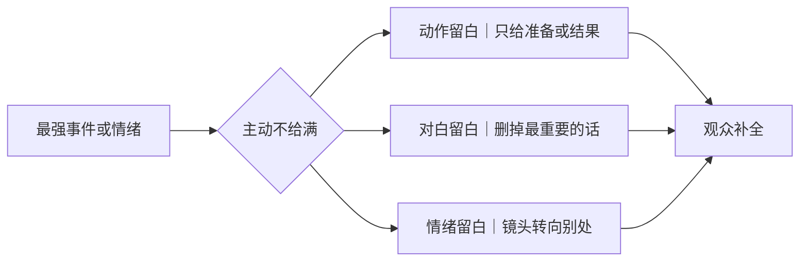

# 留白与克制
> 用途（速查）：叙述过度、情绪给太满时，学习用留白和克制增强表达。

## 留白三式

| 手法 | 操作 | 效果 |
|------|------|------|
| 动作留白 | 只拍动作的结果或准备，不拍动作本身 | 暴力/死亡/亲密——观众脑补的比拍的更强 |
| 对白留白 | 把最重要的那句话删掉 | 让观众替角色说出来 |
| 情绪留白 | 最强烈的情绪不给镜头 | 角色哭的时候切窗外，或者拍在场最远的那个人 |

### 动作留白

[Image omitted from the public edition: 动作留白：只给破杯、半开的门与门外反应，动作本身不出现. Source and reuse rights are pending verification.]

### 对白留白

[Image omitted from the public edition: 对白留白：单程票和钥匙替代最重要的一句话. Source and reuse rights are pending verification.]

### 情绪留白

[Image omitted from the public edition: 情绪留白：当事人不入镜，远处旁观者承担反应. Source and reuse rights are pending verification.]

## 克制三则

| 原则 | 说明 |
|------|------|
| 不给满 | 一场戏只给一个新信息，不要所有线索都在一场里揭完 |
| 不解释 | 人物做完重要动作后不紧接着解释动机 |
| 不煽情 | 悲情场景不配悲情音乐+慢镜+特写三件套 |

### 不给满

[Image omitted from the public edition: 不给满：只拆一个证物，其余线索继续封存. Source and reuse rights are pending verification.]

### 不解释

[Image omitted from the public edition: 不解释：戒指和钥匙留下，人物做完动作直接离开. Source and reuse rights are pending verification.]

### 不煽情

[Image omitted from the public edition: 不煽情：普通晨光、固定景别与收碗动作承载哀伤. Source and reuse rights are pending verification.]

## 检验

找一段你写了三句以上的情绪描写，删到只剩一句。
- 意思还在 → 删掉的那两句是多余的
- 意思不见了 → 剩下的那句还不够精准，换一句
