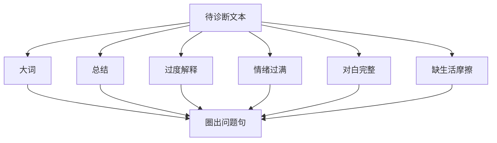

# AI味六病识别

> **公开图像说明：** 原资料中未完成再分发权核验的图片不进入公开仓库；本页只显示已登记的原创公共图示。详见 [视觉资产登记](../../../docs/VISUAL_ASSETS.md)。
> 用途（速查）：拿到AI生成的剧本或自己的草稿，逐项排查AI味六大病因。

## 六病清单

| 病因 | 症状 | 举例 |
|------|------|------|
| 大词 | 频繁用抽象概念代替具体动作 | "他感受到了生命的重量""正义终将到来" |
| 总结 | 角色替观众总结（旁白/独白/对白中说教） | "我终于明白，家人的意义就是……" |
| 过度解释 | 把人物的所有动机和情绪都说出来 | "她之所以离开，是因为童年被抛弃的创伤让她……" |
| 情绪过满 | 每个场景都塞满情绪，没有呼吸空间 | 哭→拥抱→和解→感动，一个场景塞四个高潮 |
| 对白完整 | 每个角色每句话都说完整，像在朗读 | 没有打断/停顿/改口/省略 |
| 缺生活摩擦 | 世界太干净，只有主线相关的东西 | 角色从不找钥匙、等外卖、接错电话、踩到狗 |

> [!visual-note] 视觉说明
> 以下均为本库原创情境示意，不是电影截图，也不是对某部影片的复刻。每张图只诊断一种“病”，用图内的“问题 → 可拍”标记比较抽象表达与可观察动作；示例用于识别机制，不直接升级为普遍规律。

## 诊断三步

1. **圈**：用六病逐句圈出问题句
2. **判**：判定最严重的三种病因
3. **治**：对照 A3-19《去AI味改写流程》处理

## 快速识别口诀

- 看到"感受到""意识到""明白了" → 大词病
- 看到"原来""终于""真正的" → 总结病
- 看到"因为他童年/因为她性格" → 过度解释病
- 看到连续三个感叹号/情感词 → 情绪过满病
- 看到每句话都有主谓宾、句号 → 对白完整病
- 看到所有细节都为剧情服务 → 缺生活摩擦病
