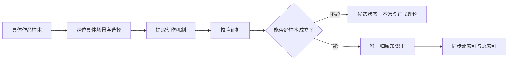

# 拉片与技法蒸馏
> 用途（速查）：对一部优秀作品做完整拉片分析的标准流水线，八层流程为纲；第8层的技法蒸馏铁律与技法卡 schema 一并在此，全库统一为一套。

## 核心原则

先问"这段为什么存在"，再问"我能怎么复用"。只分析创作机制，不评价好不好看。

[Image omitted from the public edition pending source and reuse-rights verification.]

> [!visual-note] 归属门
> 拉片不建立独立展馆。镜头运动回 A1 摄影卡，调度与剪辑回 A2，结构与编剧方法回 A3，平台语法与提示词实战回 B 层；单片样本和证据不足的规律保持候选。

## 八层标准流程

| 层级 | 分析内容 | 输出 |
|------|---------|------|
| 1-作品基础信息 | 类型/时长/结构概览/一句话梗概 | 作品档案 |
| 2-故事引擎 | 主角欲望/阻碍/核心选择/代价 | 引擎图 |
| 3-结构拆解 | 三幕/起承转合/钩子/高潮/结尾 | 结构图 |
| 4-场景功能 | 每场戏的功能/变化/进入退出点 | 场景分析表 |
| 5-人物塑造 | 欲望/缺陷/弧光/选择/关系 | 人物分析 |
| 6-对白分析 | 目的/潜台词/绕圈/信息释放 | 对白拆解 |
| 7-去AI味分析 | 为什么不像AI写的/用了什么具体手法 | 去AI味笔记 |
| 8-技法蒸馏 | 可复用规则/错误模仿风险/写作自检 | 技法卡（六要素，见下） |

## 三大禁止

1. 禁止影评口吻（不写"节奏紧凑""人物丰满"）
2. 禁止大段复述剧情（只写必要概述）
3. 禁止照搬原作表达（提炼规则，不复制台词）

## 蒸馏铁律

| # | 规则 | 违反后果 |
|---|------|---------|
| 1 | 必须有具体作品样本，不能凭空编造 | 伪蒸馏：看起来对但不能用 |
| 2 | 必须定位到具体场景、具体人物选择、具体对白机制 | 结果太泛，不能指导创作 |
| 3 | 输出技法卡：按下方六要素 schema，缺一不可 | 缺一环就缺可操作性 |
| 4 | 不复制原文台词，用自己的话转写 | 避免版权问题 |
| 5 | 无样本时只写流程和缺口说明，不虚构内容 | 宁缺毋滥 |

## 技法卡六要素（全库唯一 schema）

拉片第8层的输出就是技法卡。全库统一使用这一套六要素，不再另立"输出五要素"等口径。

| 要素 | 内容 | 示例 |
|------|------|------|
| 名称 | 一句话概括技法 | "所求者暴露弱点，被求者掌控节奏" |
| 来源 | 哪部作品哪场戏 | 《教父》开场 Bonasera 求助 |
| 原理 | 为什么有效（改变了什么信息/关系/压力/情绪） | 求助者先暴露需求 → 处于弱势 → 被求者可提出条件 |
| 复用规则 | 脱离原作，怎么迁移到新作品（含写作自检问题） | 任何权力不对等对话中，先让弱势方提出请求，再让强势方回应 |
| 正例 | 自己的原创例子 | （用新人物新情境重写） |
| 反例 | 学歪的例子（错误模仿风险） | （写一个照搬设定但逻辑断裂的版本） |

## 蒸馏公式

**当人物处于某种困境时，不要直接写情绪或主题 → 让他面对具体阻碍 → 通过一个具体选择 → 付出具体代价 → 用动作/物件/场景变化完成情绪落地。**

这个公式必须可替换人物、困境、阻碍、选择和代价。
