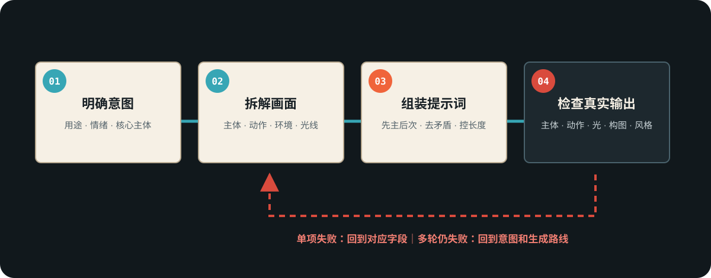

# 四步工作流程
> 用途（流程）：从创意到最终提示词的四步标准流程 + 输出质量检查清单，确保每次输出都达标。

## 四步流程总览



```
第一步：明确意图（想做什么？）
    ↓
第二步：拆解画面（画面里有什么？）
    ↓
第三步：组装提示词（用七字段拼装）
    ↓
第四步：检查输出（达标了吗？）
```

---

## 第一步：明确意图

在写任何提示词之前，先回答以下三个问题：

1. **用途是什么？** —— 图片生成 / 视频生成 / 分镜脚本文档 / 创意探索
2. **情绪基调是什么？** —— 用1-2个中文情绪词锁定（如：压抑、温暖、史诗、日常）
3. **核心主体是谁/是什么？** —— 用一句话描述最重要的画面元素

锁定这三个答案后，才进入下一步。如果这三个答案中有任何一个模糊，提示词结果必然漂移。

判断标准：能用一句话说清「我要一张什么样的图/视频」→ 进入第二步。说不清 → 先回到创意构思阶段。

---

## 第二步：拆解画面

将创意拆解为七字段（参照 B2-01 的七字段定义），逐字段填写。

实操顺序建议：
1. 先填 **Subject（主体）**——最重要的元素，决定了画面核心
2. 再填 **Environment（环境）**——主体在哪里
3. 接着填 **Action（动作）**——主体在做什么
4. 然后填 **Lighting（光线）**——根据情绪基调选择光线方向和质感（查 B2-06）
5. 再填 **Composition（构图）**——根据主体和动作选择景别和角度
6. 最后填 **Style（风格）** 和 **Camera/Quality（画质）**——根据用途和平台选择

填写检查点：
- 每个字段至少有1个具体描述词，不能为空
- Subject字段是否足够具体？（不能只写 `a girl`）
- Lighting字段是否与第一步锁定的情绪基调一致？

---

## 第三步：组装提示词

将七字段按顺序拼接，字段间用逗号分隔，形成一段完整的英文提示词。

组装规则：
1. **顺序固定**：Subject → Action → Environment → Lighting → Composition → Style → Camera/Quality
2. **逗号分隔**：字段之间用英文逗号 `,` 分隔
3. **先主后次**：每个字段内部，最重要的描述词放前面
4. **控制总长度**：
   - 图片生成提示词：建议 50-150 词
   - 视频生成提示词：建议 30-80 词（视频模型对长提示词的遵从度较低）（适用于英文短提示词流；即梦中文长提示词流不受此限，见 B3-平台实战组）
5. **不写否定句**：AI模型对否定词理解不稳定，用正面描述替代（如不写 `no background`，写 `solid white background`）
6. **不写模糊修饰**：避免 `beautiful`、`nice`、`good` 等无指向词

示例拼接过程：

| 步骤 | 字段 | 内容 |
|------|------|------|
| 1 | Subject | `a young woman with messy auburn hair` |
| 2 | Action | `sitting on a fire escape, smoking a cigarette` |
| 3 | Environment | `rainy New York alley at night, fire escapes and brick walls` |
| 4 | Lighting | `neon pink and blue light reflecting on wet surfaces` |
| 5 | Composition | `medium shot, dutch angle, shallow depth of field` |
| 6 | Style | `neo-noir cinematic, moody atmospheric` |
| 7 | Camera | `shot on Arri Alexa, anamorphic, 8K, film grain` |

**最终提示词：**
```
a young woman with messy auburn hair, sitting on a fire escape smoking a cigarette, rainy New York alley at night with fire escapes and brick walls, neon pink and blue light reflecting on wet surfaces, medium shot dutch angle shallow depth of field, neo-noir cinematic moody atmospheric, shot on Arri Alexa anamorphic 8K film grain
```

---

## 第四步：检查输出

生成图片/视频后，对照以下检查清单逐项核对：

### 必检项（任何一项不通过即需修改）

| 编号 | 检查项 | 通过标准 |
|------|--------|---------|
| C1 | 主体一致性 | 画面主体与提示词Subject字段一致，无额外/缺失人物 |
| C2 | 动作准确性 | 主体姿态/动作与Action字段描述一致 |
| C3 | 光线氛围 | 光线方向和质感与Lighting字段一致，氛围匹配情绪基调 |
| C4 | 构图景别 | 景别和角度与Composition字段一致 |
| C5 | 风格统一 | 画面风格与Style字段一致，无风格混杂 |
| C6 | 画质达标 | 清晰度、细节丰富度达到Camera/Quality字段要求 |

### 常见问题修复指南

| 问题表现 | 原因 | 修复方法 |
|---------|------|---------|
| 主体数量不对（多了/少了人） | Subject描述不够明确 | 增加数量限定词如 `a single person`、`exactly two women` |
| 动作没被执行 | Action描述太复杂 | 简化为单一核心动作，去掉次要动作 |
| 光线方向反了 | Lighting关键词冲突 | 删掉矛盾的光源词，只保留一个主光源 |
| 景别不对（要特写出了全景） | Composition描述位置靠后 | 将景别关键词移到提示词更前面的位置 |
| 风格混杂 | Style字段写了两种矛盾风格 | 只保留一种主导风格 |

### 修改迭代原则
- 每次只改一个字段，观察效果变化
- 修改后重新生成，再过一遍检查清单
- 同一提示词迭代不超过3次，若仍不达标则重新回到第一步审视意图
