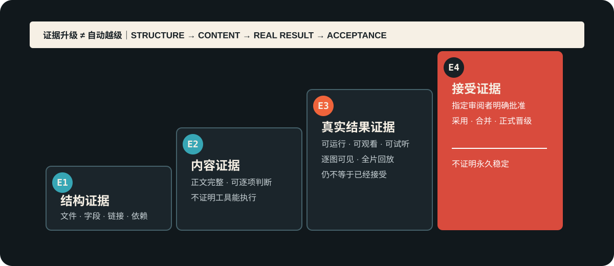

# 状态与证据等级

> 用途（状态卡）：防止把“我检查过了”“程序跑通了”“文件已经生成”越级写成内容通过、成品通过或用户确认。

## 先分开四类事实

| 层级 | 可以证明 | 不能证明 | 典型证据 |
|---|---|---|---|
| E1 结构证据 | 文件、字段、链接和依赖存在 | 内容正确或好用 | 文件清单、结构校验、链接检查 |
| E2 内容证据 | 正文、提示词、分镜或设计可被逐项判断 | 工具能执行、画面能成立 | 完整正文、差异表、审阅记录 |
| E3 运行 / 视觉证据 | 程序真实运行，图片真实可见，视频/音频真实播放 | 用户已经认可 | 运行结果、逐图检查、完整回放、可打开链接 |
| E4 接受证据 | 指定审阅者明确接受、采用或批准 | 永久稳定、适合所有任务 | 明确确认、合并决定、正式资产状态 |

## 统一状态词

| 状态 | 定义 | 最低证据 |
|---|---|---|
| 草稿 | 已有内容，但尚未完成本轮自检 | 可查看草稿 |
| 内部验证通过 | 制作者按适用门检查通过，尚未交给最终审阅者 | E1/E2/E3 中与交付物匹配的证据 |
| 已交付待审 | 审阅者已经获得可判断的真实结果 | 可直接打开、阅读、观看或运行 |
| 用户确认通过 | 审阅者明确接受或采用 | 明确确认记录 |
| 未完成 / 继续验证 | 关键结果、证据、权限或真实体验仍缺失 | 缺口与下一验证动作 |
| 退役 | 已决定不再用于当前生产 | 退役理由、替代项或禁回条件 |

## 证据必须匹配交付物

| 交付物 | 最低完成证据 |
|---|---|
| 剧本 / 提示词 / 知识卡 | 用户点名格式的完整正文 |
| 分镜 | 可读镜头表、时长闭合、空间与连续性检查 |
| 图片 / 资产 | 实际可见图片、版本与候选/正式状态 |
| 视频 / 音频 | 可播放文件和完整观看/试听记录 |
| Skill | 对真实产物造成的可见变化；结构检查只记结构状态 |
| 数据结论 | 时点、来源、口径、计算过程和未知边界 |
| GitHub 发布 | 公开页面、提交或标签、下载物、在线检查结果 |

## 过关句式

合格的状态结论写成：

> `<对象>` 已达到 `<状态>`；证据是 `<可打开或可复核结果>`；尚未证明 `<更高一级事实>`。

例如：“本 Skill 结构验证通过，19 个依赖闭合；尚未因此证明 19 个模块都已通过真实项目和用户验收。”
