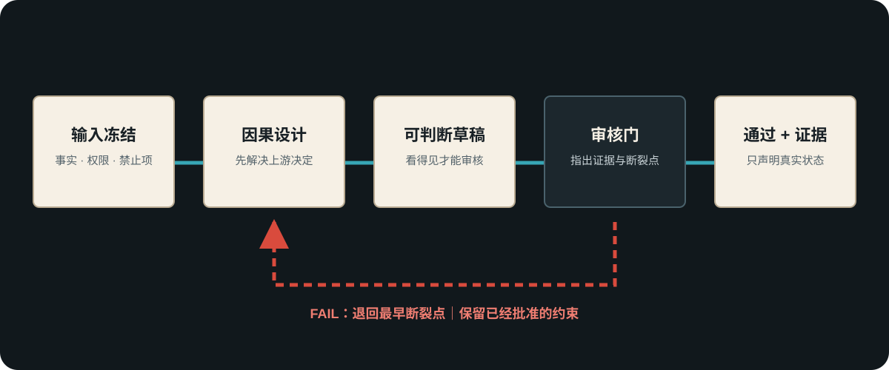

# 失败定位与定向退回

> 用途（回炉卡）：当结果未通过时，找到最早断裂的因果或合同，把工作退回到负责的层，而不是无目的地重试或全部推倒。



## 五步定位

1. **写可见失败**：只写能在正文、画面、声音、运行或发布页上指出的现象。
2. **找到最早断裂点**：问“哪个上游决定一旦修正，下游问题会同时消失？”
3. **区分原因与症状**：人物突然改口是症状；前场景没有刺激、目的或知识变化才可能是原因。
4. **指定责任层**：故事、资产、空间/镜头、风格、平台执行、审核证据或发布边界。
5. **保留已批准约束**：只重开造成失败的决定，不自动改变已经通过的故事、资产、版本或范围。

## 退回路由

| 可见失败 | 优先检查 | 退回位置 | 禁止的伪修复 |
|---|---|---|---|
| 情节不抓人、人物选择不成立、台词无回应 | 目标、阻力、刺激、策略、代价 | 剧本 / 导演判断 | 只润色台词或加热词 |
| 人脸、服装、场景或道具漂移 | 资产版本、锁定特征、状态 | 资产合同 | 靠更多风格词掩盖 |
| 越轴、镜像房间、人物瞬移、光向反转 | 世界坐标、机位投影、动作与光源 | 调度 / 分镜 | 再生成一次碰运气 |
| 画面“高级”但不服务剧情 | 视觉概念、信息顺序、可观察功能 | 视觉语言设计 | 堆导演名、镜头名、滤镜 |
| 平台无法按计划生成 | 时长、镜头密度、语法、平台能力 | 平台转译 / 拆镜 | 改写已批准故事事实 |
| 文件存在但无法判断 | 输出格式、打开路径、状态和证据 | 交付层 | 用日志和文件名代替结果 |
| 图片、文本或数据不能公开 | 权利、隐私、来源、授权 | 发布边界 | 先上传再补来源 |

## 单变量回测

可以单独隔离的生成或提示词问题，每轮只改变一个主要变量并记录结果。连续少量迭代仍失败时，不再在同一层微调，返回意图、资产或生产路线重新判断。

## 退回单

```text
主失败：<一个最影响验收的可见问题>
证据：<位置、画面、时间点或可复现步骤>
最早断裂点：<上游决定>
退回层：<负责模块>
保留项：<已经批准且不得改变的内容>
修正动作：<一个可执行改变>
复验标准：<什么可见结果才算修好>
```

## 通过标准

退回单能让另一位创作者只修改责任层，并在不丢失已批准约束的前提下复验同一个失败点。
