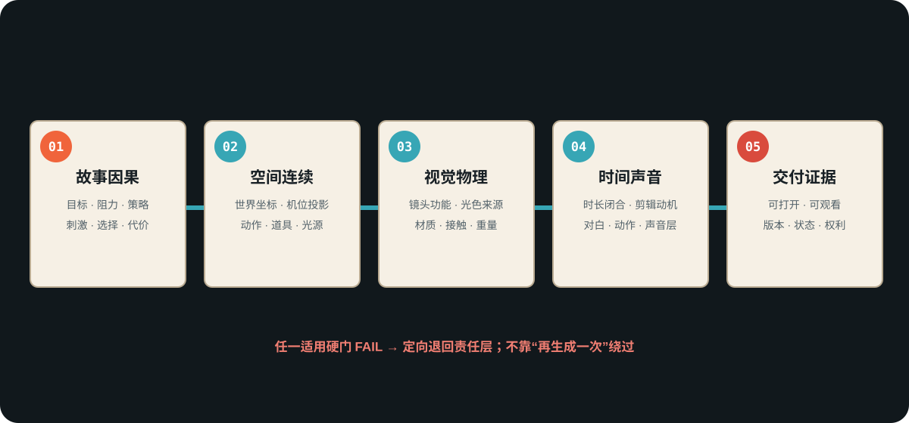

# AI影视成品五门验收

> 用途（成品门）：按交付物实际适用的层级审核剧本、分镜、资产、生成镜头、声音与成片。没有对应媒介时标“不适用”，不能伪造通过。

## 第一门：故事因果

- 人物现在要什么，为什么现在必须行动？
- 阻力是否迫使人物换策略，而非只增加事件？
- 台词是否有刺激、目的、潜台词和对方反应？
- 本场结束状态是否直接推动、阻挡或重构下一场？

**硬失败**：人物为制造剧情而忽略明显更容易的选择；关键转折没有动作、信息或代价支持。

## 第二门：空间与连续性

- 场景、人物、道具和光源是否存在于一个固定世界状态？
- 换机位后左右、前后、遮挡、出框和受光是否由新投影重新推导？
- 动作是否遵守接触、受力、位移、反应和尾帧状态？
- 资产版本、人物朝向、持有物和损伤是否连续？

**硬失败**：房间镜像、无因果越轴、人物瞬移、道具复位、光源无故换侧。

## 第三门：视觉与物理

- 景别、机位、运动、构图、光色和材质是否共同承担本段信息？
- 画面中的光是否有来源，暗部是否仍保留必要信息？
- 重量、接触、遮挡、反射、天气和环境反馈是否可信？
- 风格是否被翻译成可观察参数，而不是名字和形容词？

**硬失败**：技术词齐全但镜头没有叙事作用；“电影感”只靠滤镜、雾、霓虹或器材标签。

## 第四门：时间、剪辑与声音

- 各时间段之和是否等于总时长？
- 台词语速、停顿、动作和镜头运动能否放入时长？
- 剪辑点是否由信息、动作、情绪或关系变化触发？
- 环境声、动作声、对白和音乐是否有层次，且不互相遮蔽？

**硬失败**：台词和动作客观装不下；隐藏硬切被写成连续运镜；声音只写“震撼 BGM”。

## 第五门：交付与证据

- 用户点名的媒介是否真实存在并能打开、阅读、观看或运行？
- 当前版本、状态、范围和未解决边界是否明确？
- 自动检查、人工审阅和用户接受是否分开记录？
- 若要公开，权利、隐私、来源和许可是否已过闸？

**硬失败**：用提示词证明成片、用测试证明审美、用文件路径证明用户已经获得结果。

## 判定规则

| 判定 | 条件 | 动作 |
|---|---|---|
| PASS | 所有适用硬门通过，有匹配证据 | 进入下一状态或交付 |
| REWORK | 失败可在当前责任层修复 | 生成定向退回单 |
| BLOCKED | 缺输入、权限、权利或外部状态，当前无法安全继续 | 写清唯一阻塞条件与恢复入口 |
| NOT APPLICABLE | 本交付物没有该媒介或层级 | 说明原因，不计入通过率 |

五门通过仍只代表本轮规定的验收状态；用户未明确接受时，不得写“用户确认通过”。
