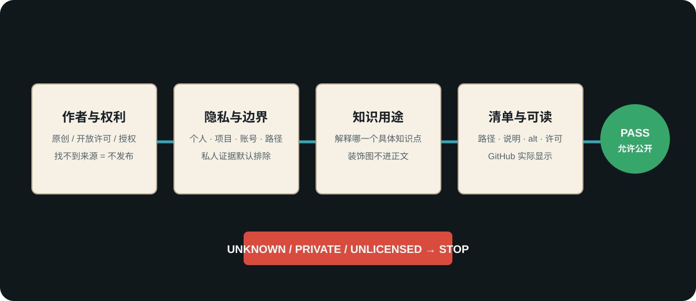

# 知识与图片公开过闸

> 用途（发布门）：在文字、图片、图表或知识卡进入公开仓库前，逐项核对原创性、来源、隐私、可复用性、时效和 GitHub 阅读质量。

## 文字准入四档

| 判定 | 条件 | 处置 |
|---|---|---|
| 纳入 | 原创或可合规引用，事实已核，适用边界清楚 | 公开 |
| 修正后纳入 | 过时、错误或过度概括，但可由可靠证据修正 | 改正并记录 |
| 加限定后纳入 | 经验值、文化倾向、候选方法或时效事实 | 标状态、时点与失效条件 |
| 排除 | 编造、无来源承诺、整段复制、私人内容或无法证明权利 | 不公开 |

## 图片逐张过闸

每张准备公开的图片都必须有一条资产记录：

| 字段 | 必填内容 |
|---|---|
| 文件 | 仓库内稳定相对路径 |
| 作者 / 生成者 | 能够承担授权的人或明确来源机构 |
| 权利依据 | 自有原创、明确开放许可、公共领域或书面授权 |
| 知识用途 | 它解释哪一个具体知识点 |
| 修改说明 | 裁切、标注、重绘或未修改 |
| 出现位置 | 哪些知识卡嵌入 |
| 替代文字 | 不看图片也能理解的准确描述 |
| 复核状态 | 通过、待补来源或排除 |

以下任一情况直接排除：

- 只知道“来自网上”，找不到原始页面、作者与许可；
- 电影截图、课程图、书页、社交媒体截图或品牌素材没有明确再分发依据；
- 含个人身份、私人项目、内部界面、账号、路径、密钥或未公开资产；
- 图片漂亮但不能解释正文知识；
- 许可限制与仓库许可证冲突；
- 用 AI 生成但权利、人物、商标或训练来源风险无法接受。

## GitHub 阅读门

- 图片放在它解释的段落旁，不建立脱离正文的装饰图库。
- 使用可在 GitHub 直接渲染的 PNG、JPEG、WebP、GIF 或 SVG。
- 文件名稳定、无本机绝对路径；相对链接通过检查。
- 每张图有具体替代文字，不写“图片”“示意图”。
- 图中文字在常见桌面和手机宽度上可读；大图提供清楚标题和图例。
- 权利不明的原图可以保留在私人源库，但公开版不上传，也不留下假装可用的断链。

## 公开边界

可复用知识不等于全部本地内容。公开仓库通常排除：个人项目、私人复盘、原始对话、个人画像、内部运行记录、公司/客户内容、凭据、账号状态、本机配置和权利不明资产。

公开联系方式是维护者主动授权的例外；其他个人信息不能因同处一个知识库而自动获得公开许可。

## 通过标准

- [ ] 每张公开图片都有资产清单和权利依据
- [ ] 每段外部事实有适当来源、时点或限定
- [ ] 私人层和个人项目未被复制
- [ ] 图片与知识点一一对应，有准确替代文字
- [ ] 本地链接、隐私和密钥扫描通过
- [ ] 公开页面在 GitHub 可直接阅读
- [ ] “内部验证通过”与“用户确认通过”分开记录
